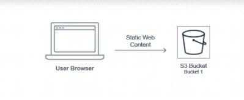

***
### __How to Build a modern Website App__

***

## __Architecture Diagram__

 <div align="center">
    
</div>
# __How to create a bucket on aws cli__
```
REPLACE_ME_BUCKET_NAME=content-static-web-hosting
aws s3 mb s3://$REPLACE_ME_BUCKET_NAME
```

* We need to set some configuration options that enable the bucket to be used for static website hosting. This configuration enables the objects in the bucket to be requested using a registered public DNS name for the bucket, as well as direct site requests to the base path of the DNS name to a selected website homepage (index.html in most cases).
```
aws s3 website s3://$REPLACE_ME_BUCKET_NAME --index-document index.html
```
```
aws s3api put-bucket-policy --bucket $REPLACE_ME_BUCKET_NAME --policy file://website-bucket-policy.json
aws s3 cp web/index.html s3://$REPLACE_ME_BUCKET_NAME/index.html 
```

__Ref:__ https://aws.amazon.com/getting-started/hands-on/build-modern-app-fargate-lambda-dynamodb-python/module-one/

***
## __We have provided a CloudFormation template to create all of the necessary Network and Security resources in /module-2/cfn/core.yml. This template will create the following resources:__

  * An Amazon VPC - a network environment that contains four subnets (two public and two private) in the 10.0.0.0/16 private IP space, as well as all the needed Route Table configurations. The subnets for this network are created in separate AWS Availability Zones (AZ) to enable high availability across multiple physical facilities in an AWS Region. Learn more about how AZs can help you achieve high availability.
  * Two NAT Gateways (one for each public subnet) - allows the containers we will eventually deploy into our private subnets to communicate out to the Internet to download necessary packages, etc.
  * A DynamoDB VPC Endpoint - our microservice backend will eventually integrate with Amazon DynamoDB for persistence (as part of module 3).
  * A Security Group - Allows your Docker containers to receive traffic on port 8080 from the Internet through the Network Load Balancer.
  * IAM Roles - Identity and Access Management Roles are created. These will be used throughout the workshop to give AWS services or resources you create access to other AWS services like DynamoDB, S3, and more.

```
aws cloudformation create-stack --stack-name MythicalMysfitsCoreStack --capabilities CAPABILITY_NAMED_IAM --template-body file://core.yml
```
## __Architecture Diagram__

<div align="center">
    
</div>


***
