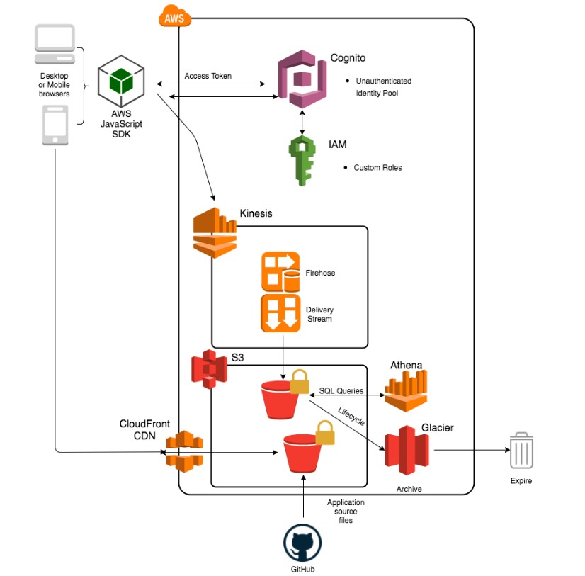
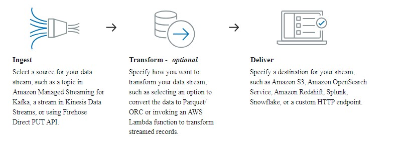

<div align="center">
	<h1>Amazon Data Firehose</h1>
	
</div>

 <h1>How Amazon Data Firehose works</h1>


### add cognito id and region the in loungebeer.js file then upload all files to s3

```
DROP TABLE IF EXISTS loungebeer
DROP database If EXISTS loungebeer
```
