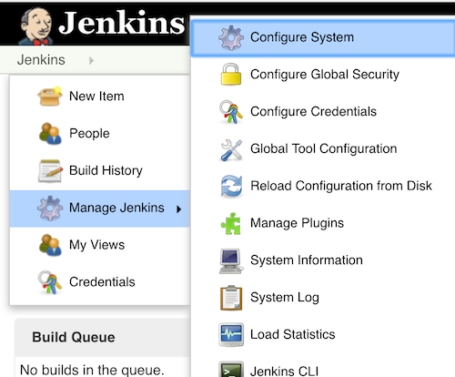
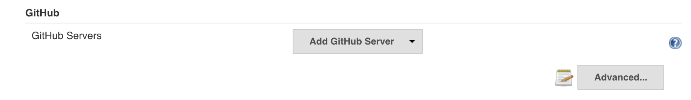
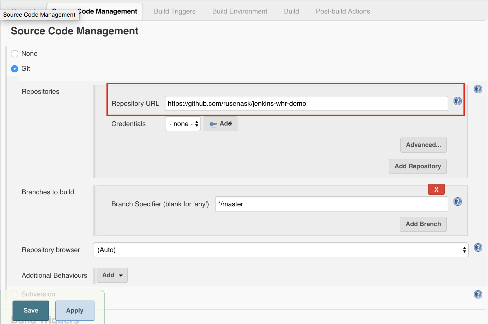
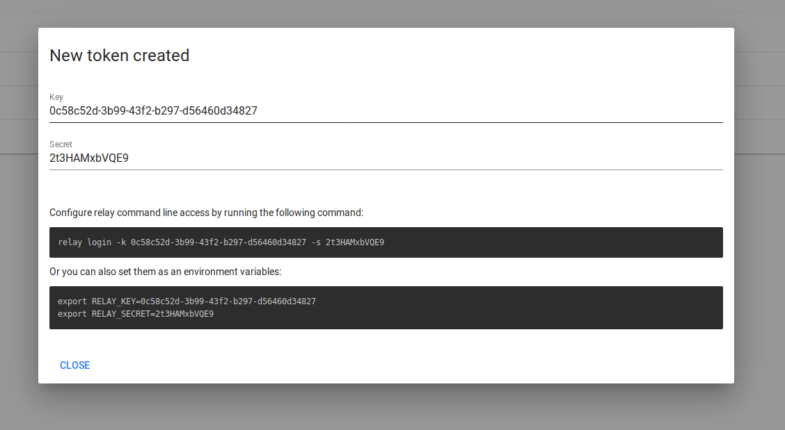
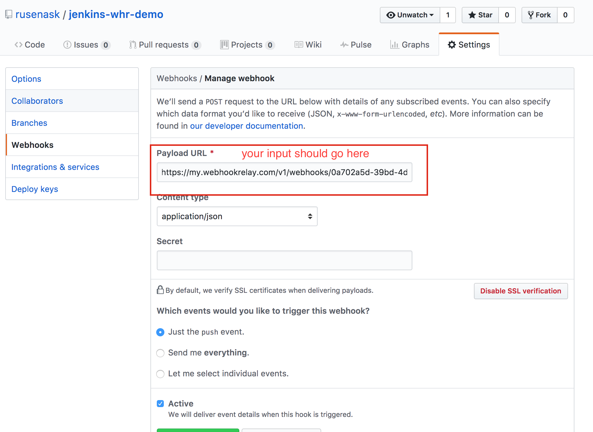

# __How to Receive Github webhooks on Jenkins without public IP__

### __Introduction__

Jenkins is probably the most popular CI tool. Since Dev and Ops roles are growing more and more alike we need to reduce initially required ‘activation energy’ to adopt automation tools. Building and testing software should be easy, fast and reliable. Current technique known as polling repository usually results in constant delays where engineers have to wait till the next CI scanning cycle.

Another option is to use webhooks but that requires you to expose your CI server to the public internet (you can still whitelist IPs though).

In this article we are going to show how to configure end-to-end CI pipeline where you can instantly
trigger jobs via Webhook Relay service without internal Jenkins being exposed to public internet.

### __Desired workflow__
****

Let’s say we need to connect GitHub with internally deployed Jenkins which is not reachable from outside. In order to do this, we will be using Webhook Relay:


<div align="center">
    
</div>

Once webhook is relayed by the agent, Jenkins pulls the newest code and executes the configured job.

### __Step 1: Create GitHub repository__
****
First things first, we need to get a repository! If you haven’t got GitHub account, get one.
You will need it later to login to Webhook Relay too.
Once you have logged into GitHub, look for a green “New Repository” button on the bottom right corner and click it.

<div align="center">
    
</div>


Choose public option as it will make this tutorial slightly quicker. Don’t close this repo window as we will be back there shortly.

### __Step 2: Jenkins Installation (if you already have it - ignore this step)__
****
It’s time to get that Jenkins up and running! Head to https://jenkins.io/download/ and download our beloved (it’s not pretty but gets the job done) Jenkins. In this guide we use standard installation but I would recommend using dockerized images, especially since it’s so easy to build a new image on top of the official one.

##### __If you need latest version and quick start up with jenkins__
```docker
mkdir /home/ivanpedro/project/jenkins

docker run -d --name jenkins -u `id -u` -p 8080:8080 -p 50000:50000 -v /home/ivanpedro/project/jenkins:/var/jenkins_home  jenkins/jenkins
cat /home/ivanpedro/project/jenkins/secrets/initialAdminPassword
```

### __Step 3: Setting up Jenkins with Github-Plugin__
****
The easiest way to start receiving GitHub webhooks is by using this plugin https://plugins.jenkins.io/github:

 * Go to your Jenkins plugin manager
 * Find and install “GitHub plugin” (at the time of writing - current version was 1.29.0 and the plugin is installed when you click on the option install recommended plugins)
 * Once it’s installed, we will need to configure it:

<div align="center">
    
</div>

Add default GitHub server (don’t bother adding credentials as we are using public repo anyway):

<div align="center">
    
</div>


### __Step 4: Configuring Jenkins Job__
****
When you want Jenkins to do something - create a job. In this case we will be using Freestyle project:

<div align="center">
    
</div>


We have to configure several sections here - __Source Code Management__ and __Build Triggers__. First, set repository (in this case it’s my demo app repo repository):

<div align="center">
    
</div>


Next step is setting a build trigger to GitHub hook trigger for GITScm polling:

<div align="center">
    
</div>

### __Step 5: Configuring Webhook Relay__
****
First of all you will have to register and download the agent. See installation instructions if you don’t have an account yet (you can use GitHub OAuth option since you would already have an account with it).

For authentication, agents use pairs of keys and secrets or regular account usernames/passwords. Head to the tokens page (left navigation menu) and create one key/secret pair. Be sure to copy those somewhere so you don’t lose them in the next 2 minutes.

#### __bash script to install the cli for Linux x86-64 (64-bit)__
```bash
sudo wget -O /usr/local/bin/relay https://storage.googleapis.com/webhookrelay/downloads/relay-linux-amd64
sudo chmod +wx /usr/local/bin/relay
```

#### __If your are using jenkins in a docker contantiner__
```bash
docker exec -it -u root  jenkins bash 
sudo wget -O /usr/local/bin/relay https://storage.googleapis.com/webhookrelay/downloads/relay-linux-amd64
sudo chmod +wx /usr/local/bin/relay
```
#### __Fast road with docker__
There are alternative options to run the forwarding daemon, such as Docker container.

```docker
docker run --name whr-relayd --net host --restart always -d webhookrelay/webhookrelayd:latest --mode tunnel -t mytunnelname -k [access key] -s [access secret]
```

### __Step 6: Setting up Webhook Relay agent__
****
To login with the CLI use token (generate it [here](https://my.webhookrelay.com/)) key/secret:

<div align="center">
    
</div>

```
relay login -k your-token-key -s your-token-secret

relay login -k  ae55f3ee-88ce-7795-99c7-e3e47e3d85fd  -s 12fkNbo9xUIO

```
#### __To get a custom subdomain and enable SSL you need to specify two flags: --subdomain (or -s) and --crypto:__
```bash
relay connect -s inchora http://localhost:8080/ --crypto flexible
```

#### __Start tunnel__
```
$ relay connect :8080
Connecting: 
http://lsw7eq49jlhsuldvhpiyku.webrelay.io <----> http://127.0.0.1:8080
https://lsw7eq49jlhsuldvhpiyku.webrelay.io <----> http://127.0.0.1:8080
```

#### __Note:__ Crypto flag flexible enables both HTTP and HTTPS endpoints.

You will then need to start forwarding webhooks to Jenkins:
```
relay forward --bucket github-jenkins http://localhost:8080/github-webhook/ &
Forwarding:
https://my.webhookrelay.com/v1/webhooks/6edf55c7-e774-46f8-a058-f4d9c527a6a7 -> http://localhost:8080/github-webhook/
Starting webhook relay agent...
1.511438424864371e+09	info	webhook relay ready...	{"host": "api.webhookrelay.com:8080"}
```

#### __What can be forwarded?__
****
Currently Webhook Relay forwards:

  * Body (up to 3MB)
  * Headers
  * URL query, for example https://my.webhookrelay.com/v1/webhooks/2e50b993-ac45-48f7-b840-eb054b19e630?foo=bar, will be forwarded to http://localhost:8080?foo=bar
  * Extra path that’s after your public input endpoints: https://my.webhookrelay.com/v1/webhooks/2e50b993-ac45-48f7-b840-eb054b19e630/directory/foo will be forwarded to http://localhost:8080/directory/foo


  Once you have your Input URL (in this case it’s https://my.webhookrelay.com/v1/webhooks/6edf55c7-e774-46f8-a058-f4d9c527a6a7) get back to GitHub’s webhook configuration and set it:


<div align="center">
    
</div>
 
### __Create sample application__
****

On the Webhook Relay logs page https://my.webhookrelay.com/logs you should be a able to see sent logs.

#### __The relay cli log looks like follow:__
****
> 2020-03-18 19:40:11.604	INFO	webhook request relayed	{"destination": "http://localhost:8080/github-webhook/", "method": "POST", "bucket": "github-jenkins", "status": "200 OK", "retries": 0}
