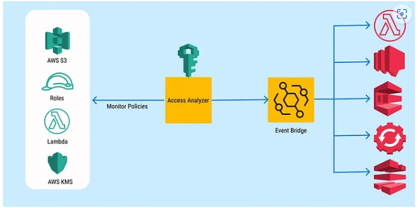

---

IAM Access Analyzer helps you identify the resources in your organization and accounts, such as Amazon S3 buckets or IAM roles, shared with an external entity. This lets you identify unintended access to your resources and data, which is a security risk. IAM Access Analyzer identifies resources shared with external principals by using logic-based reasoning to analyze the resource-based policies in your AWS environment. For each instance of a resource shared outside of your account, IAM Access Analyzer generates a finding. Findings include information about the access and the external principal granted to it. You can review findings to determine if the access is intended and safe or if the access is unintended and a security risk. In addition to helping you identify resources shared with an external entity, you can use IAM Access Analyzer findings to preview how your policy affects public and cross-account access to your resource before deploying resource permissions.
---
