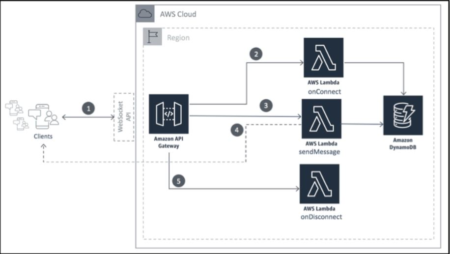

***

 <div align="center">
    <h1>WEB Socket API<h1/>
    
</div>

***

### __connect to the outputted wss url using wscat:__

```
npm install -g wscat
wscat -c wss://{YOUR-API-ID}.execute-api.{YOUR-REGION}.amazonaws.com/{STAGE}
```
```
wscat -c wss://yx250d1iy4.execute-api.eu-west-1.amazonaws.com/test
{"action":"sendmessage", "data":"hello world"}
```
***
