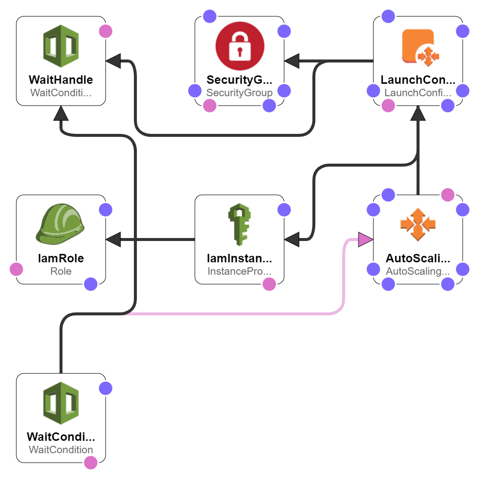

***

 <div align="center">
    
</div>

***
### __Dynamic DynamoDB__

You can configure Dynamic DynamoDB to scale your tables up and down automatically, and you can restrict scaling activities to certain time slots. You can scale read and write throughput capacity independently using upper and lower thresholds, and you can set minimums and maximums for each value. Finally, Dynamic DynamoDB supports a circuit-breaker. Before it performs any scaling activities, it can verify that your application is up and running. This final check will avoid spurious scale-down activities if your application is experiencing other problems.

```
vim /etc/dynamic-dynamodb/dynamic-dynamodb.conf 
```

### __Start dynamic dynamodb__
```
sudo service dynamic-dynamodb start
```
***
*__Ref:__* https://aws.amazon.com/blogs/aws/auto-scale-dynamodb-with-dynamic-dynamodb/

***
