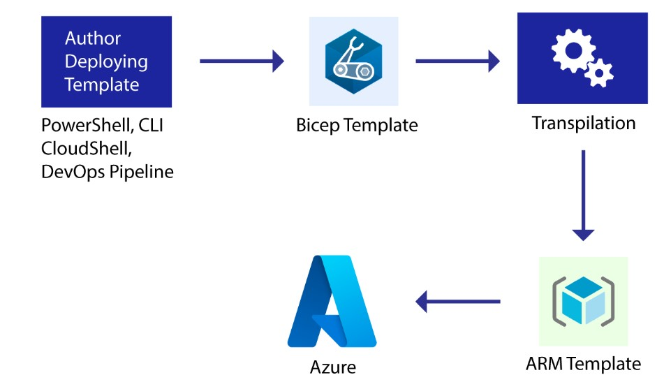

***
 <div align="center">
    
</div>

***

### __ Log in to Azure account using Azure CLI as a first step to interact with Azure resources by using the following command:__
```
az login -u student-3290-1937515@labscloudacademy.onmicrosoft.com -p Ca1_CLGWMsYV
```

#### The .bicep extension tells you that this is a deployment template written in the Bicep language. For any Bicep syntax-highlighting to occur, the file extension needs to be .bicep.
***


```
az deployment group --help
```

### __Initiate the following variables that will store the required values for the arguments mentioned:__
```
resourceGroupName=$(az group list --query "[].{name:name}" --output tsv)
deploymentName="castorageaccountdeployment"
templateFile="storageAccount.bicep"
```

### __Deploy the Bicep template using the following command:__
```
az deployment group create --resource-group $resourceGroupName --name $deploymentName --template-file $templateFile
```

```
storageAccountName=$(az storage account list --query "[].{name:name}" --output tsv)
az storage account show \
--name $storageAccountName \
--resource-group $resourceGroupName \
--query "{Name:name, Location:location, ResourceGroup:resourceGroup, SKU:sku.name}" \
--output table
```