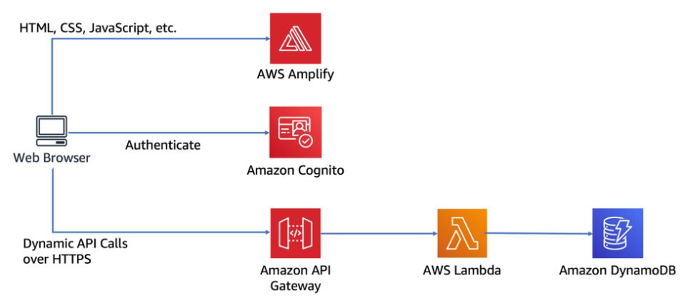

***
 <div align="center">
    
</div>
***

1- Install git
2- Go to Iam user and Upload ssh key pair and get the iam ssh key id
3- Edit local ssh configuration
```
Host git-codecommit.*.amazonaws.com
User Your-IAM-SSH-Key-ID-Here
IdentityFile ~/.ssh/Your-Private-Key-File-Name-Here
```
```
4- git clone ssh://git-codecommit.eu-west-1.amazonaws.com/v1/repos/default-serverless-web-app-repo
```
```
cd default-serverless-web-app-repo
aws s3 cp s3://wildrydes-us-east-1/WebApplication/1_StaticWebHosting/website ./ --recursive
```
```
git add .
```
```
git commit -am "first commit"
```
```
git push -u origin master
```
```
ssh -v git-codecommit.eu-west-1.amazonaws.com
```
***