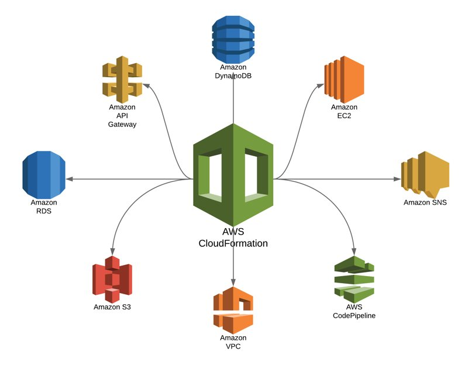

---
<div align="center">
   
</div>
---

### **How to create cloudformation stack on a aws cli**

```
aws cloudformation create-stack --stack-name Lab1 --parameters ParameterKey=InstanceType,ParameterValue=t2.micro --template-body file://lab1.yaml
```

### **How to check the status of the stack**

```
aws cloudformation describe-stacks --stack-name Lab1
aws cloudformation describe-stacks --stack-name Lab1 --query "Stacks[0].StackStatus"
```

### **How to managed changes in the cloudformation stack**

```
aws cloudformation describe-stack-resource-drifts --stack-name Lab1 --stack-resource-drift-status-filters MODIFIED DELETED
aws cloudformation create-change-set --stack-name Lab1 --change-set-name Lab1ChangeSet --parameters ParameterKey=InstanceType,ParameterValue=t2.micro --template-body file://lab1-CS.yaml
```

### **How to delete the stack**

```
aws cloudformation delete-stack --stack-name Lab1
```
