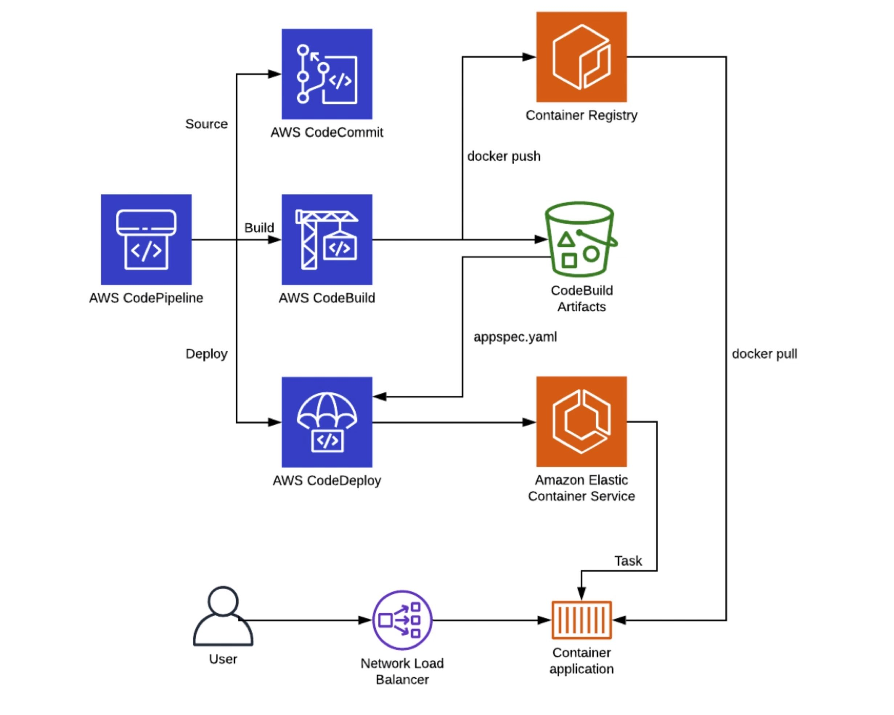
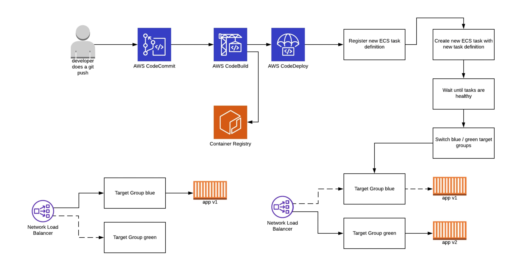

***

 <div align="center">
    <h1>Codepipeline ECS-Fargate & EC2 Fleet</h1>
    
</div>

***
 <div align="center">
    
</div>
***
```
cd code
git clone <repo-url>
git remote remove origin
cp ../app/config/* .
cp ../app/scripts/create-new-task-def.sh .

git remote add origin ssh://git-codecommit.eu-west-1.amazonaws.com/v1/repos/default-pipe-codecommit-repo
git add .
git commit -am "deploy code"
git push -u origin master
```

1. Go to iam and select your user 
2. Go to security credential
cat ~/.ssh/id_rsa.pub
3. Upload you public key pair
4. Copy the id. example (APKAEIBAERJR2EXAMPLE)

vim ~/.ssh/config

Host *
  StrictkHostKeyChecking no

Host git-codecommit.*.amazonaws.com
  User APKAEIBAERJR2EXAMPLE
  IdentityFile ~/.ssh/codecommit_rsa

```
chmod 600 ~/.ssh/config
```

* ###  __Test if repo works__
ssh git-codecommit.us-east-2.amazonaws.com

* ### __Clone repo__
git clone ssh://git-codecommit.eu-west-1.amazonaws.com/v1/repos/app-node-prod
* ### __To push to the repo__

git add .  
git commit -m "first commit"  
git push --set-upstream ssh://git-codecommit.eu-west-1.amazonaws.com/v1/repos/app-node-prod master  
git remote add origin ssh://git-codecommit.eu-west-1.amazonaws.com/v1/repos/app-node-prod  

* ### __Push repo__
git clone ssh://Your-SSH-Key-ID@git-codecommit.eu-west-1.amazonaws.com/v1/repos/app-node-pro  
url-http = https://git-codecommit.eu-west-1.amazonaws.com/v1/repos/app-node-prod  
url-ssh = ssh://git-codecommit.eu-west-1.amazonaws.com/v1/repos/app-node-prod  

```
mysql -h <endpoint> -P 3306 -u <mymasteruser> -p
```
***
*__Ref:__* https://github.com/awslabs/ec2-spot-labs/tree/master/ec2-fleet
***