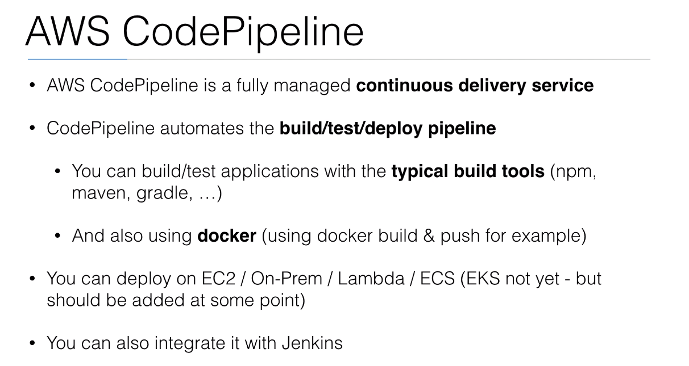

# __CodePipeline Project__
***

    <h3>"What is Codepipeline?"</h3>

    

    <h3>"Codepipeline integrations"</h3>

    

***

    <h3>Diagram</h3>

    

***
We will deploy a resource codepipeline which defines the following stages:

### __Stages of codepipeline__

  The develper pushes the code to AWS codecommit.

  * _Source_ __(CodeCommit)__
  CodeCommit is where we store our code. Where codecommit detect new changes on the repo it triggers codepipeline to start building.

  * _Build_  (CodeBuild)
  The build uses docker build and docker push command. It creates the images using Dockerfile stored in git  repo. The image built will be stored in a container Registry.
  The artifacts will be stored in an S3 bucket.
  
    __Uses artifacts files:__
     - appspec.yaml
     - taskdef.json

  * _Deploy_ (CodeDeploy)
    The deployment will be done on ECS service using a new task by pulling the images from docker registry. the task will be assign to a loadbalancer and when the task is healthy; the app is deployed using Blue/Green deployment strategy in a target group. Then the user can reach the url of the loadbalancer app.
