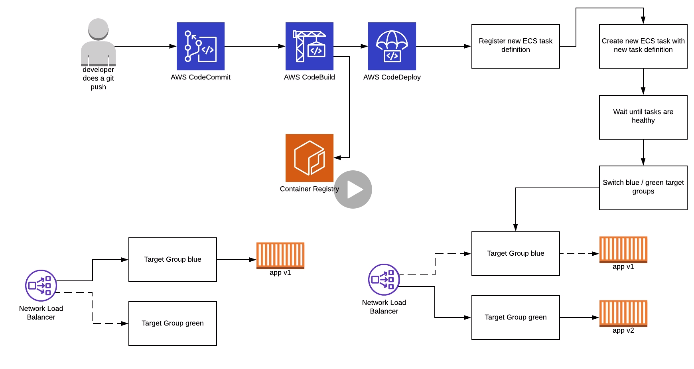

# __CodePipeline Project__
***

    <h3>"What is Codepipeline?"</h3>

    

    <h3>"Codepipeline integrations"</h3>

    

***

    <h3>Diagram</h3>

    

***
We will deploy a resource codepipeline which defines the following stages:

### __Stages of codepipeline__

  The develper pushes the code to AWS codecommit.

  * _Source_ __(CodeCommit)__

  CodeCommit is where we store our code. The code contains the app and the files to do the build step. Where codecommit detects new changes on the repo it triggers codepipeline to start building.

  * _Build_  __(CodeBuild)__

  The build uses docker build and docker push command (file config "buildspec.yml"). It creates the images using Dockerfile stored in git  repo. The image built will be stored in a container Registry.
  The artifacts will be stored in an S3 bucket. An S3 cache example is commented out in case we need it.
  The task defiinition will be updated with the latest image with and script called "create-new-task-def.sh"
   
    __creates and stores artifacts files in S3 bucket:__
     - appspec.yaml
     - taskdef.json

  * _Deploy_ __(CodeDeploy)__

    The deployment will be done on ECS service using a new task by pulling the images from docker registry. the task will be assign to a loadbalancer and when the task is healthy; the app is deployed using Blue/Green deployment strategy in a target group which will be swithed in every successful deployment. Then the user can reach the url of the loadbalancer app.

    The service fargate is used to provide autoscale.
    You can set up the fargate service in a private subnet to improve security. Make sure if you use private 
    subnets you have a nat gateway enable on your vpc.

    <h3>WorkFlow detailed</h3>

    

***
