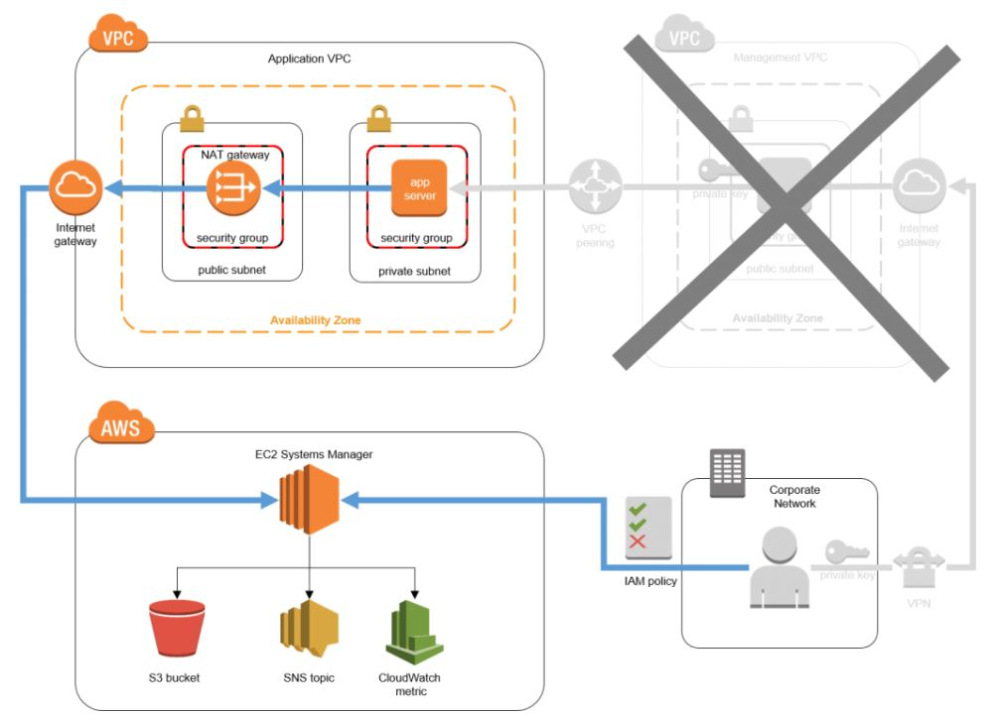

***
### __Artchitecture Diagram of Ec2-systems-manager__

The new architecture, seen in the diagram below, shows how the use of Systems Manager eliminates the need for the bastion components and helps simplify the system architecture. Users no longer interact directly with the application hosts; Systems Manager is the broker that facilitates the execution of commands:

 

    

***

    <h1 style="text-align:center;">Alternative solution</h1> 

Systems Manager allows you to remotely execute commands on managed hosts without using a bastion host (you might know this feature as EC2 Run Command). A host-based agent polls Systems Manager to determine whether a command awaits execution.

Here are some of the benefits:

   * This approach uses an AWS managed service, meaning that the Systems Manager components are reliable and highly available.
   * Systems Manager requires an IAM policy that allows users or roles to execute commands remotely.
   * Systems Manager agents require an IAM role and policy that allow them to invoke the Systems Manager service.
   * Systems Manager immutably logs every executed command, which provides an auditable history of commands, including:

      - The executed command
      - The principal who executed it
      - The time when the command was executed
      - An abbreviated output of the command

   * When AWS CloudTrail is enabled to record and log events in the region where you’re running Systems Manager, every event is recorded by CloudTrail and logged in Amazon CloudWatch Logs.
   * Using CloudTrail and CloudWatch rules gives you the ability to use Systems Manager events as triggers for automated responses, such as Amazon SNS notifications or AWS Lambda function invocations.
   * Systems Manager can optionally store command history and the entire output of each command in Amazon S3.
   * Systems Manager can optionally post a message to an SNS topic, notifying subscribed individuals when commands execute and when they complete.
   * Systems Manager is agent-based, which means it is not restricted to Amazon EC2 instances. It can also be used on non-AWS hosts that reside on your premises, in your data center, in another cloud service provider, or elsewhere.

You don’t have to manage SSH keys.
You are responsible for the costs of the resources that use Systems Manager, such as EC2 instances, SNS messages, and S3 storage.

***
__Ref:__ https://aws.amazon.com/blogs/mt/replacing-a-bastion-host-with-amazon-ec2-systems-manager/
***