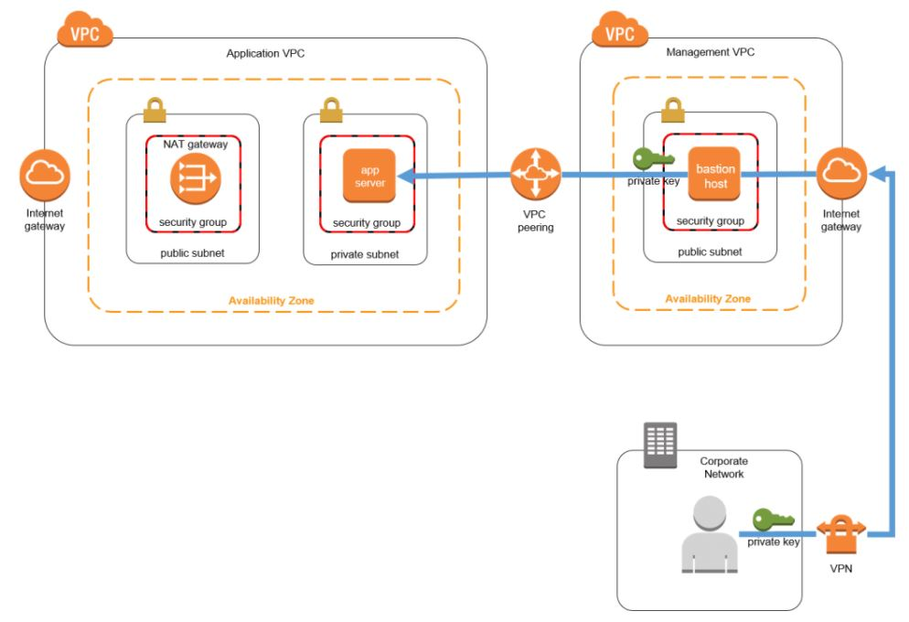
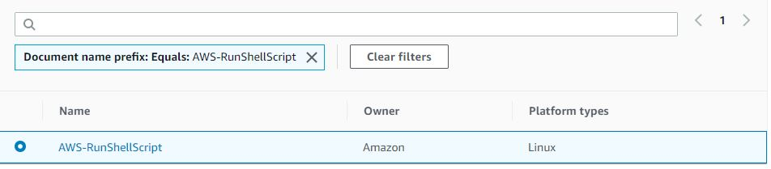
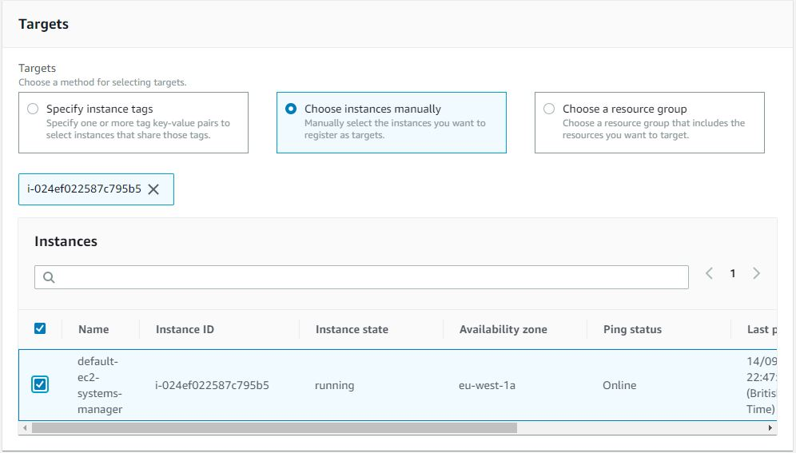
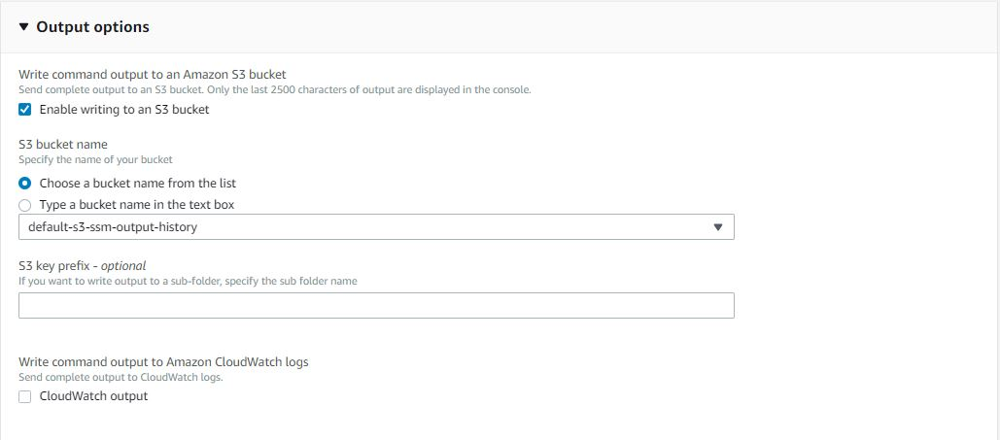
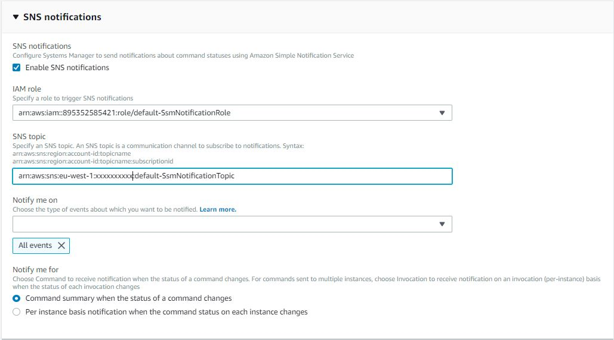
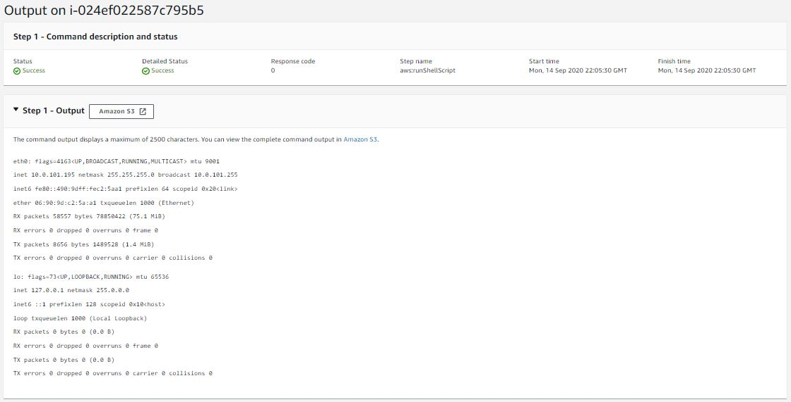

***
<div align="center">
    <h1>Artchitecture Diagram of Host Bastion or Jump servers</h1> 
</div>

Bastion hosts (also called “jump servers”) are often used as a best practice for accessing privately accessible hosts within a system environment. For example, your system might include an application host that is not intended to be publicly accessible. To access it for product updates or managing system patches, you typically log in to a bastion host and then access (or “jump to”) the application host from there.

<div align="center">
    
</div>

***

<div align="center">
    <h1>Artchitecture Diagram of EC2-Systems-Manager</h1> 
</div>

The new architecture, seen in the diagram below, shows how the use of Systems Manager eliminates the need for the bastion components and helps simplify the system architecture. Users no longer interact directly with the application hosts; Systems Manager is the broker that facilitates the execution of commands:

<div align="center">
    
</div>

***

<div align="center">
    <h1>Alternative solution</h1> 
</div>

Systems Manager allows you to remotely execute commands on managed hosts without using a bastion host (you might know this feature as EC2 Run Command). A host-based agent polls Systems Manager to determine whether a command awaits execution.

Here are some of the benefits:

   * This approach uses an AWS managed service, meaning that the Systems Manager components are reliable and highly available.
   * Systems Manager requires an IAM policy that allows users or roles to execute commands remotely.
   * Systems Manager agents require an IAM role and policy that allow them to invoke the Systems Manager service.
   * Systems Manager immutably logs every executed command, which provides an auditable history of commands, including:

      - The executed command
      - The principal who executed it
      - The time when the command was executed
      - An abbreviated output of the command

   * When AWS CloudTrail is enabled to record and log events in the region where you’re running Systems Manager, every event is recorded by CloudTrail and logged in Amazon CloudWatch Logs.
   * Using CloudTrail and CloudWatch rules gives you the ability to use Systems Manager events as triggers for automated responses, such as Amazon SNS notifications or AWS Lambda function invocations.
   * Systems Manager can optionally store command history and the entire output of each command in Amazon S3.
   * Systems Manager can optionally post a message to an SNS topic, notifying subscribed individuals when commands execute and when they complete.
   * Systems Manager is agent-based, which means it is not restricted to Amazon EC2 instances. It can also be used on non-AWS hosts that reside on your premises, in your data center, in another cloud service provider, or elsewhere.

You don’t have to manage SSH keys.
You are responsible for the costs of the resources that use Systems Manager, such as EC2 instances, SNS messages, and S3 storage.


***
#__Hands on__

```
terraform validate
terraform plan
terraform apply -auto-approve
```

# __To use Systems Manager, follow these steps:__

  1- Log in to your AWS account and navigate to the EC2 console.  
  2- In the left navigation pane, under Systems Manager, choose Managed Instances.
  3- Select the instance created by the CloudFormation template or terraform from the previous section, click action and choose Run a command.  
  4- On the Run a command screen, scroll down the list of command documents and select AWS-RunShellScript. The platform type is Linux. If you were targeting a Windows host, select “AWS-RunPowerShellScript” instead. Take notice of the other command documents in this list. We won’t cover the other commands in this blog post, but you can select a command document later that fits a more specific use case.

<div align="center">
    
</div>
  5- Ensure the target instance created from the CloudFormation template in the previous section is selected.  
  6- For Commands, type the following command:

  ```
  ifconfig
  ```
<div align="center">
    
</div>

<div align="center">
    
</div>

<div align="center">
    
</div>

<div align="center">
    
</div>

  8- After you initiate the command, choose View Managed Instances.  
  9- To view the command history, under Systems Manager, choose Run Command.  
  10- After a short period of time, the command completes its execution. To see the abbreviated output of the command on the Systems Manager console, choose Output, View Output.

<div align="center">
    
</div>

  For longer outputs, you can also view the complete command output in the S3 bucket that you specified earlier. In addition, you should have received an email indicating that the Systems Manager command was executed; it can sometimes take few minutes to receive the email.


```
terraform destroy -auto-approve
```

***
__Ref:__ https://aws.amazon.com/blogs/mt/replacing-a-bastion-host-with-amazon-ec2-systems-manager/
***