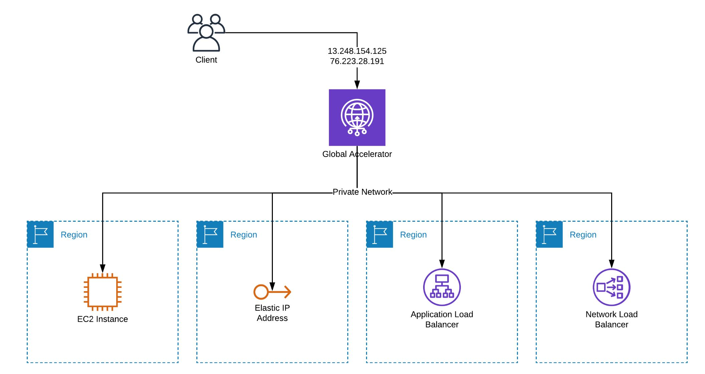

    <h1>AWS Global Accelerator </h1>
    <h2>Improving Latency and Design for Failure</h2>

***

 
   <h3>AWS Global Accelerator features</h3>
   

    <b>
       <ul style="list-style-type:circle;">
         <li>Static anycast IP addresses</li>
         <li>Fault tolerance using network zones</li>
         <li>Global performance-based routing</li>
         <li>TCP Termination at the Edge</li>
         <li>Bring your own IP (BYOIP)</li>
         <li>Fine-grained traffic control</li>
         <li>Continuous availability monitoring</li>
         <li>Client affinity</li>
         <li>Distributed denial of service (DDoS) resiliency at the edge</li>
       </ul> 
    </b>
   

***

 
   <h3>How It Works</h3>
   

The Global Accelerator provides two static Anycast IPv4 addresses. All you need to do is to define endpoints in one or multiple regions. The following endpoints are supported:

  * _Internet-facing Application Load Balancer (ALB)_
  * _Internal Application Load Balancer (ALB)_
  * _Internet-facing Network Load Balancer (NLB)_
  * _Elastic IP_
  * _EC2 Instance (with or without Public IP)_

 

    

***

 
   <h3>To make use of Global Accelerator, you need to:</h3>
   

     <ol type="1">
       <li>Create an accelerator which provisions two static Anycast IP addresses.</li>
       <li>Create a listener for the protocol and port or port range.</li>
       <li>Create an endpoint group for every region you want to route traffic to.</li>
       <li>Add an endpoint (e.g., an ALB) to each endpoint group.</li>
     </ol>
   

***

    <h3>Use cases:</h3>
    

       <ol type="1">
          <li>Multi-Region: deploy your infrastructure to multiple regions and route traffic to the region that is closest to the client.</li>
<li>Disaster Recovery: shift traffic from a region or endpoint affected by an outage to another endpoint. The Anycast IP addresses make sure all clients send requests to healthy endpoints only immediately.1 Doing so is a challenge when using routing mechanisms based on Route 53 (DNS) due to caching issues.</li>
<li>Static IP Address: some clients (e.g., IoT devices) might not be able to resolve names via DNS, or static IP addresses might be needed for a firewall rule (NLB is an alternative in that scenario).</li>
<li>Low Latency: all scenarios, where latency is critical (e.g., trading, gaming, …).</li>
<li>Blue-Green or Canary Deployment: shift traffic between infrastructures during deployments or for testing purposes.</li>
<li>Origin Cloaking: use the Global Accelerator as public and protected (see AWS Shield) endpoint for an ALB or EC2 running in a private subnet.</li>
      </ol>
    

***

 
   <h3>CloudFront vs. Global Accelerator</h3>
   

   
 When optimizing for low latency and response times, CloudFront - the    Content Delivery Network (CDN) - is an obvious choice. Both services optimize the route of a request from clients all over the world to your endpoints. However, CloudFront can process a request and cache a response from 200 locations distributed worldwide. The Global Accelerator routes the packages to one of your endpoints (one or multiple endpoints optionally distributed among regions).

   There is another fundamental difference between CloudFront and Global Accelerator: CloudFront caches responses from your endpoints. At best, CloudFront can answer an incoming request from an edge location near to the client without forwarding a request to your endpoint. Depending on your workload, the majority of requests are cacheable, which reduces the response times and latencies enormously.

   In summary, the result of the latency benchmark with the same setup, as described above, is not a surprise. The Global Accelerator reduces the latency to the ALB. But still, the package is routed from each continent to the ALB in eu-west-1. CloudFront, on the other hand, was able to cache the responses at the edge locations.
   

   

***
