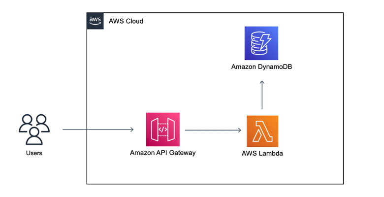

<div align="center">

</div>

---

### **Local Build: To create a local build of the Lambda function for testing, use the sam build command:**

```
sam build --hook-name terraform --beta-features --profile ivan-arteaga-dev
```

### **Local invoke: The first test is to invoke the Lambda function with a mocked event payload from the API Gateway. These events are in the events directory. Run this command, passing in a mocked event:**

```
sam local invoke aws_lambda_function.lambda_function -e events/new-review.json --beta-features --profile ivan-arteaga-dev
```

### **Another test is to run a local emulation of the Lambda service using “sam local start-lambda” and invoke the function directly using AWS SDK or the AWS CLI. Start the local emulator with the following command:**

```
sam local start-lambda
```

### **AWS SAM starts the emulator and exposes a local endpoint for the AWS CLI or a software development kit (SDK) to call. With the start-lambda command still running, run the following command to invoke this function locally with the AWS CLI:**

```
aws lambda invoke --function-name aws_lambda_function.lambda_function --endpoint-url http://127.0.0.1:3001/ response.json --cli-binary-format raw-in-base64-out --payload file://events/new-review.json  --profile ivan-arteaga-dev
```
