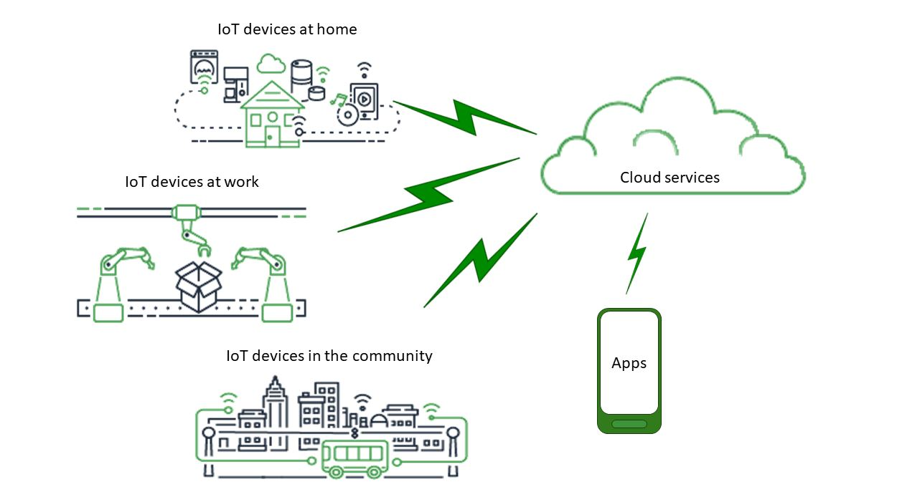
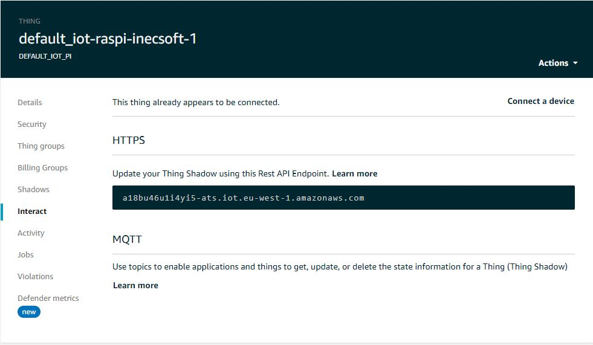
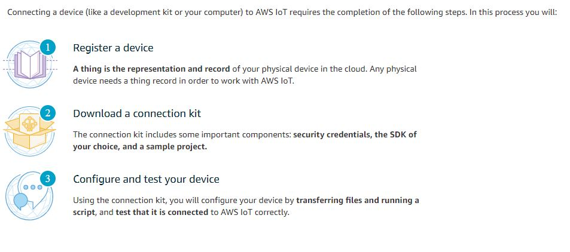
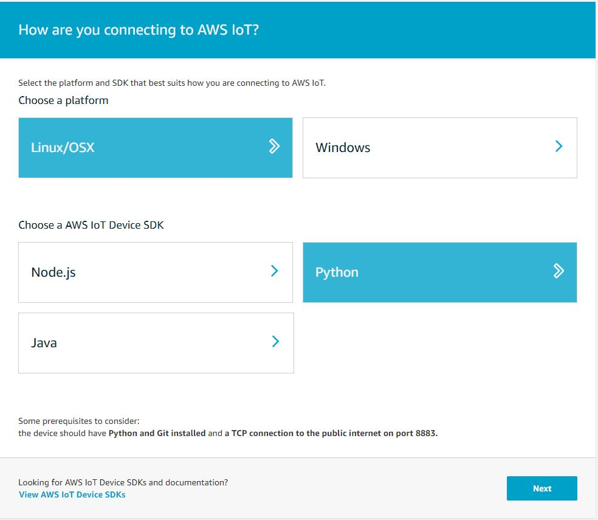
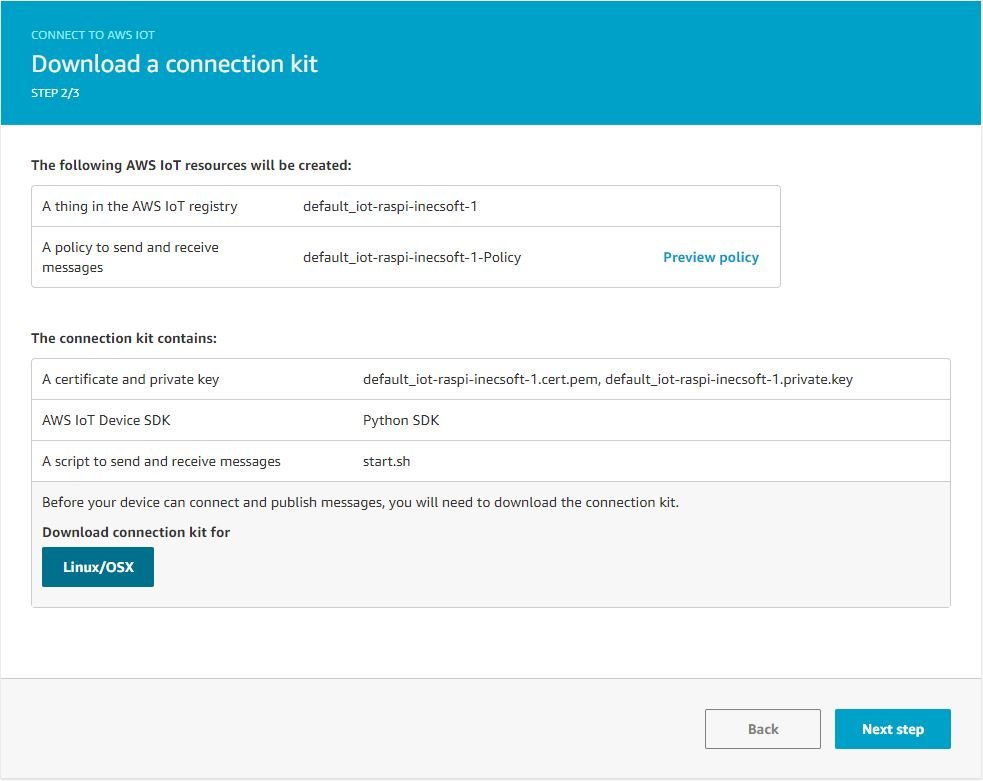
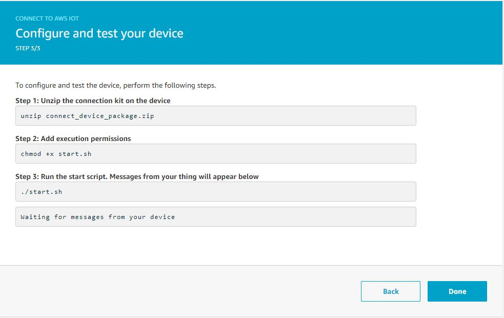

***

    <h1>IoT universe</h1>
    

***

    <h1>IoT with MQTT</h1>
    

***
The AWS IoT Device Gateway enables devices to securely and efficiently communicate with AWS IoT. The protocols supported by AWS IoT are MQTT over WebSocket, MQTT, HTTPS.
MQTT is an open OASIS and ISO standard lightweight, publish-subscribe network protocol that transports messages between devices. The protocol usually runs over TCP/IP; however, any network protocol that provides ordered, lossless, bi-directional connections can support MQTT

1. Secure
   - Policies

The following are the MQTT topics used for interacting with shadows.

Topics

   * /get
   * /get/accepted
   * /get/rejected
   * /update
   * /update/delta
   * /update/accepted
   * /update/documents
   * /update/rejected
   * /delete
   * /delete/accepted
   * /delete/rejected

2. iot thing type
3. iot thing
   - iot thing type
   - policies
4. iot certificate
5. Iot thing
  - select your thing device
  - select security and click on the certificate
  - select policies and in action attach policies
6. interact 
   - get endpoint
   - get update to this thing shadow
7. Test
   - Paste "$aws/things/${local.default_name}-${each.key}/shadow/update" and subscribe topic
   - click Publish to topic
8. Act
   - Create rule
   - Set update to this shadow was accepted
   
***

   <h1>IoT interact</h1>
   

   

   

   

   

***
*__Ref:__* https://docs.aws.amazon.com/iot/latest/developerguide/aws-iot-how-it-works.html
***