***
<div align="center">
  <h1>
    <strong>Jenkins Pipeline</strong>
  </h1>
</div>

***

<div align="center">
    
</div>

***

### __Tools that creates the following resources:__

  * _Amazon S3 bucket-Stores the GitHub repository files and the CodeBuild artifact application file that CodeDeploy uses._
  * _IAM S3 bucket policy-Allows the Jenkins server access to the S3 bucket._
  * _JenkinsRole-An IAM role and instance profile for the Amazon EC2 instance for use as a Jenkins server. This role allows Jenkins on the EC2 instance to access the S3 bucket to write files and access to create CodeDeploy deployments._
  * _CodeDeploy application and CodeDeploy deployment group._
  * _CodeDeploy service role-An IAM role to enable CodeDeploy to read the tags applied to the instances or the EC2 Auto Scaling group names associated with the instances._
  * _CodeDeployRole-An IAM role and instance profile for the EC2 instances of CodeDeploy. This role has permissions to write files to the S3 bucket created by this template and to create deployments in CodeDeploy._
  * _CodeBuildRole-An IAM role to be used by CodeBuild to access the S3 bucket and create the build projects._
  * _Jenkins server-An EC2 instance running Jenkins._
  * _CodeBuild project-This is configured with the S3 bucket and S3 artifact._
  * _Auto Scaling group-Contains EC2 instances running Apache and the CodeDeploy agent fronted by an Elastic Load Balancer._
  * _Auto Scaling launch configurations-For use by the Auto Scaling group._
  * _Security groups-For the Jenkins server, the load balancer, and the CodeDeploy EC2 instances._

***

### __Jenkins set up__

1. _ssh to jenkins server_

```
cat /var/lib/jenkins/initialAdminPassword
```

2. _On the Customize Jenkins page, choose Install suggested plugins._
3. _On the Create First Admin User page, enter a user name, password, full name, and email address of the Jenkins user._
4. _Choose Save and continue, Save and finish, and Start using Jenkins._
5. _Install additional plugins_
 
 * AWS CodeDeploy
 * AWS CodeBuild
 * Http Request
 * File Operations

### __Create a project and configure the CodeDeploy Jenkins plugin__

1. _Login then choose New Item, Freestyle project._
2. _Enter a name for the project (for example, CodeDeployApp), and choose OK._

<div align="center">
    
</div>

3. _On the project configuration page, under Source Code Management, choose Git. For Repository URL, enter the URL of your GitHub repository._

<div align="center">
    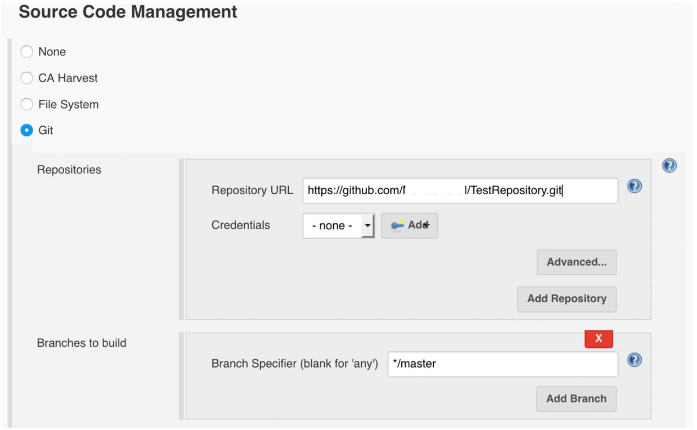
</div>

4. _For Build Triggers, select the Poll SCM check box. In the Schedule, for testing enter H/2 * * * *. This entry tells Jenkins to poll GitHub every two minutes for updates._

<div align="center">
    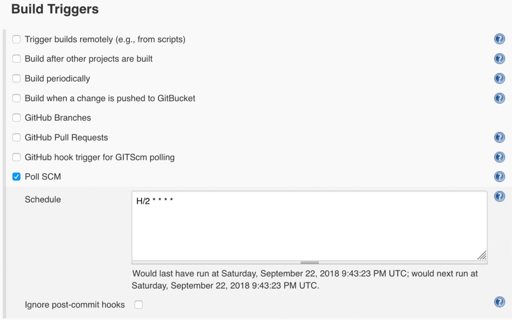
</div>

5. _Under Build Environment, select the Delete workspace before build starts check box. Each Jenkins project has a dedicated workspace directory. This option allows you to wipe out your workspace directory with each new Jenkins build, to keep it clean._

<div align="center">
    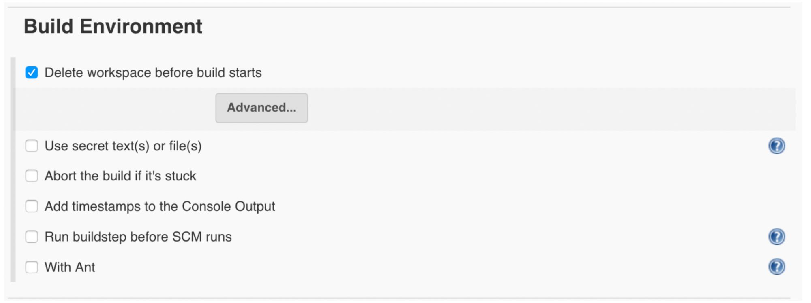
</div>

6. _Under Build Actions, add a Build Step, and AWS CodeBuild. On the AWS Configurations, choose Manually specify access and secret keys and provide the keys._

<div align="center">
    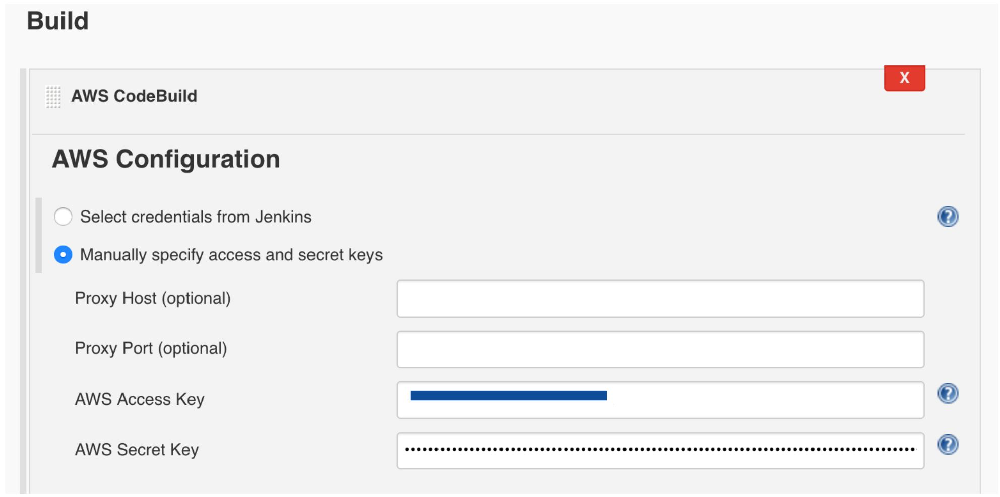
</div>

7. _From the CloudFormation stack Outputs tab, copy the AWS CodeBuild project name (myProjectName) and paste it in the Project Name field. Also, set the Region that you are using and choose Use Jenkins source.
It is a best practice is to store AWS credentials for CodeBuild in the native Jenkins credential store._

<div align="center">
    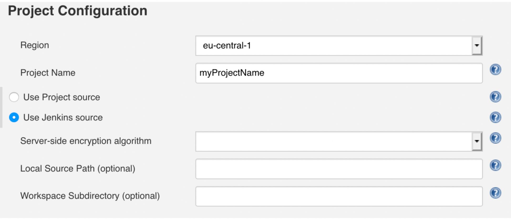
</div>

8. _To make sure that all files cloned from the GitHub repository are deleted choose Add build step and select File Operation plugin, then click Add and select File Delete. Under File Delete operation in the Include File Pattern, type an asterisk._

<div align="center">
    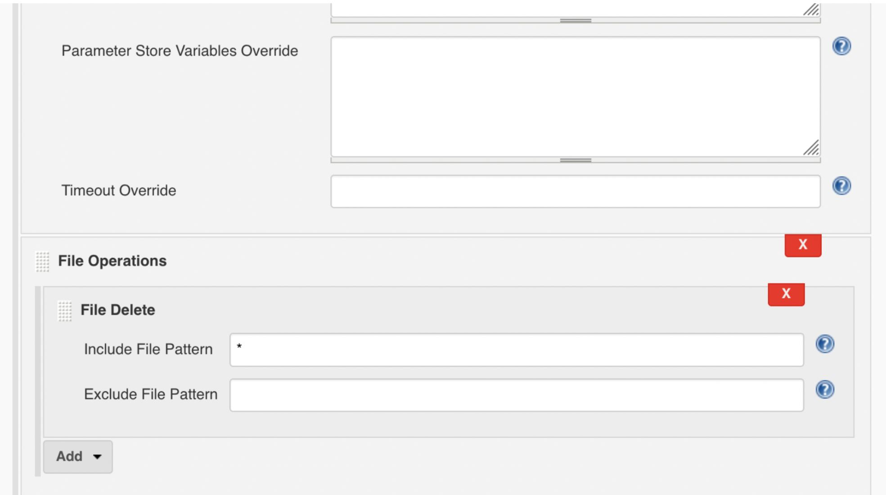
</div>

9. _Under Build, configure the following:_
   a. Choose Add a Build step.
   b. Choose HTTP Request.
   c. Copy the S3 bucket name from the CloudFormation stack Outputs tab and paste it after (http://s3-eu-central-1.amazonaws.com/) along with the name of the zip file codebuild-artifact.zip as the value for HTTP Plugin URL.
      Example: (http://s3-eu-central-1.amazonaws.com/mybucketname/codebuild-artifact.zip)
   d. For Ignore SSL errors?, choose Yes.

<div align="center">
    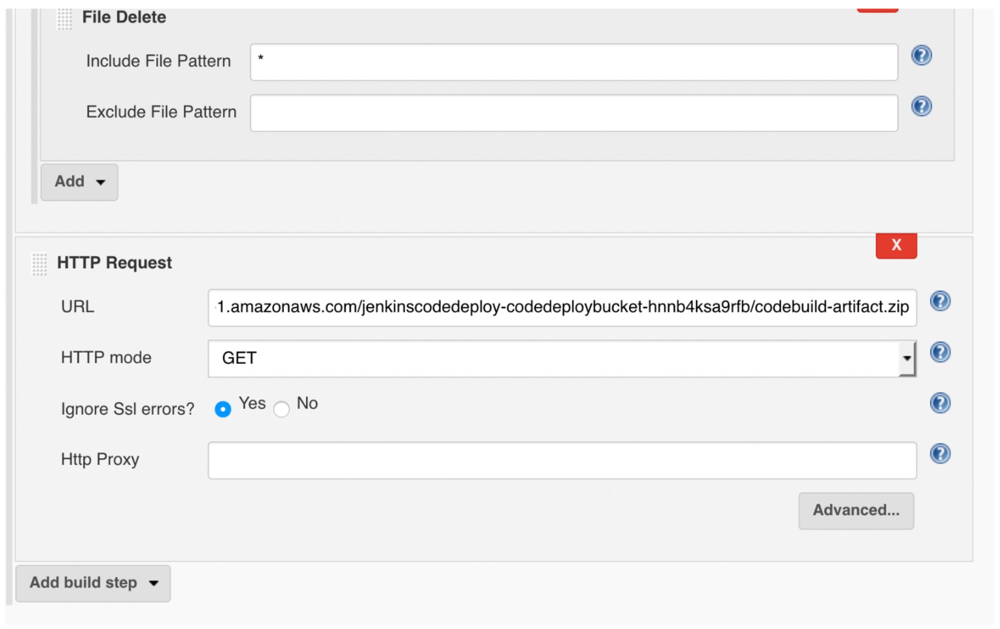
</div>

10. _Under HTTP Request, choose Advanced and leave the default values for Authorization, Headers, and Body. Under Response, for Output response to file, enter the codebuild-artifact.zip file name_

<div align="center">
    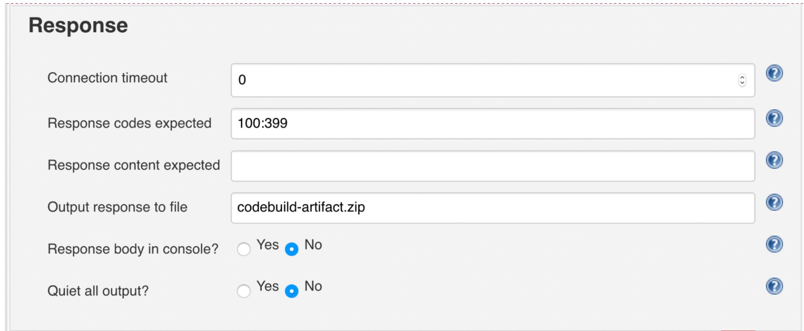
</div>

11. _Add the two build steps for the File Operations plugin, in the following order:_
   a. Unzip action: This build step unzips the codebuild-artifact.zip file and places the contents in the root workspace directory.
   b. File Delete action: This build step deletes the codebuild-artifact.zip file, leaving only the source bundle contents for deployment.

<div align="center">
    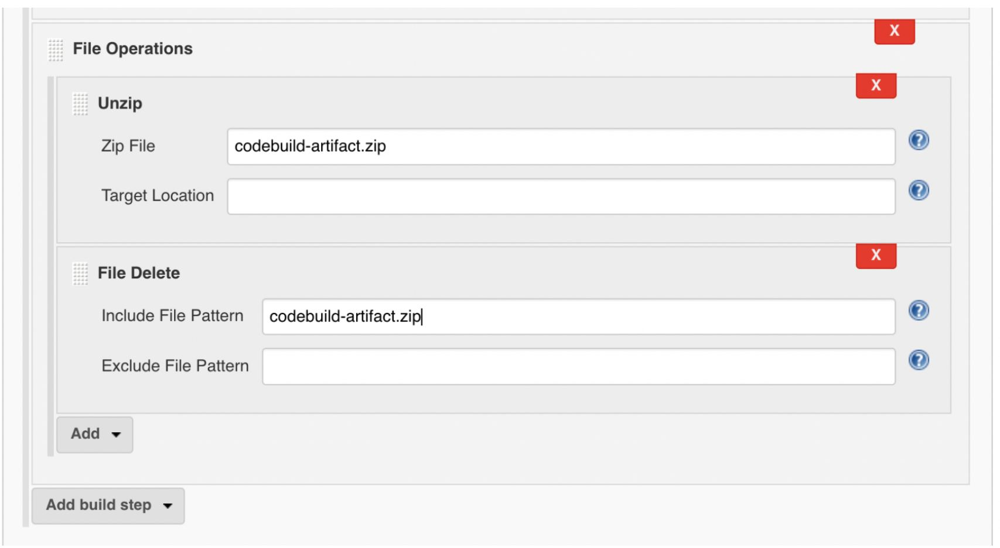
</div>

12. _On the Post-build Actions, choose Add post-build actions and select the Deploy an application to AWS CodeDeploy check box._
13. _Enter the following values from the Outputs tab of your CloudFormation stack and leave the other settings at their default (blank):_
    * For AWS CodeDeploy Application Name, enter the value of CodeDeployApplicationName.
    * For AWS CodeDeploy Deployment Group, enter the value of CodeDeployDeploymentGroup.
    * For AWS CodeDeploy Deployment Config, enter CodeDeployDefault.OneAtATime.
    * For AWS Region, choose the Region where you created the CodeDeploy environment.
    * For S3 Bucket, enter the value of S3BucketName.
      The CodeDeploy plugin uses the Include Files option to filter the files based on specific file names existing in your current Jenkins deployment workspace directory. The plugin zips specified files into one file. It then sends them to the location specified in the S3 Bucket parameter for CodeDeploy to download and use in the new deployment.
.
      As shown below, in the optional Include Files field, I used (**) so all files in the workspace directory get zipped.

<div align="center">
    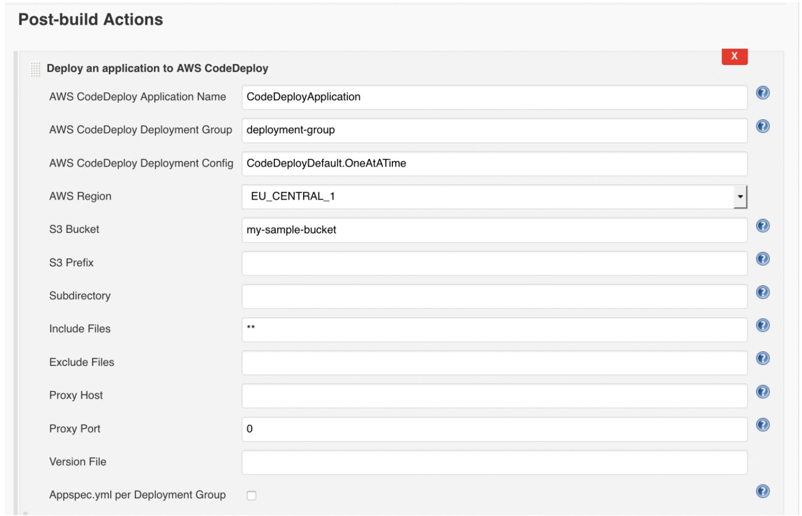
</div>

14. _Choose Deploy Revision. This option registers the newly created revision to your CodeDeploy application and gets it ready for deployment._
15. _Select the Wait for deployment to finish? check box. This option allows you to view the CodeDeploy deployments logs and events on your Jenkins server console output._

<div align="center">
    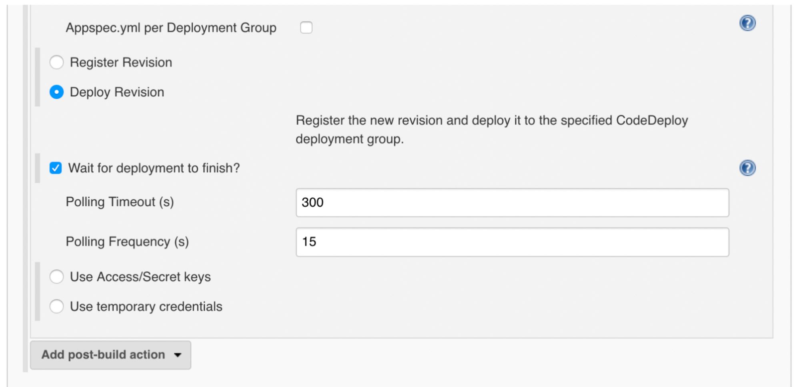
</div>

***