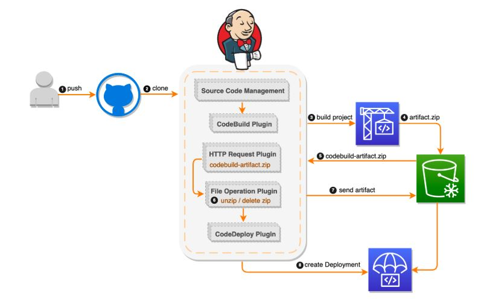

***

  <h1>
    <strong>Jenkins Pipeline</strong>
  </h1>

***

    

***

### __Tools that creates the following resources:__

  * _Amazon S3 bucket-Stores the GitHub repository files and the CodeBuild artifact application file that CodeDeploy uses._
  * _IAM S3 bucket policy-Allows the Jenkins server access to the S3 bucket._
  * _JenkinsRole-An IAM role and instance profile for the Amazon EC2 instance for use as a Jenkins server. This role allows Jenkins on the EC2 instance to access the S3 bucket to write files and access to create CodeDeploy deployments._
  * _CodeDeploy application and CodeDeploy deployment group._
  * _CodeDeploy service role-An IAM role to enable CodeDeploy to read the tags applied to the instances or the EC2 Auto Scaling group names associated with the instances._
  * _CodeDeployRole-An IAM role and instance profile for the EC2 instances of CodeDeploy. This role has permissions to write files to the S3 bucket created by this template and to create deployments in CodeDeploy._
  * _CodeBuildRole-An IAM role to be used by CodeBuild to access the S3 bucket and create the build projects._
  * _Jenkins server-An EC2 instance running Jenkins._
  * _CodeBuild project-This is configured with the S3 bucket and S3 artifact._
  * _Auto Scaling group-Contains EC2 instances running Apache and the CodeDeploy agent fronted by an Elastic Load Balancer._
  * _Auto Scaling launch configurations-For use by the Auto Scaling group._
  * _Security groups-For the Jenkins server, the load balancer, and the CodeDeploy EC2 instances._

***