***

<div align="center">
  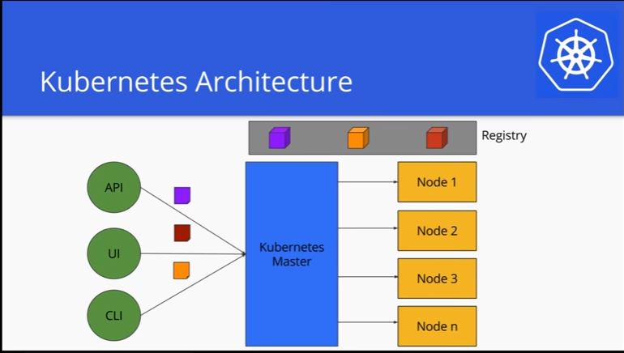
</div>

***

# __Pre-installation__

```
vim /etc/hosts

```
```
192.168.1.99 kubemaster
192.168.1.109 kube2
192.168.1.167 kube3
```

*__Note:__* Each machine can ping one another via hostname. 2CPU or more, 2 GB Ram or more.

# __Disable SELinux, swap and firewall__

### __Now we need to disable both SELinux and swap. On all three machines, issue the following commands:__

```
setenforce 0
```
```
sed -i --follow-symlinks 's/SELINUX=enforcing/SELINUX=disabled/g' /etc/sysconfig/selinux
```

__Next, disable swap (on all three machines) with the following command:__

```
swapoff -a
```
### __We must also ensure that swap isn't re-enabled during a reboot on each server. Open up the /etc/fstab and comment out the swap entry like this:__

```
sed -ie "s/\/dev\/mapper\/centos-swap swap/#\/dev\/mapper\/centos-swap swap/g" /etc/fstab
```
or

```
vim /etc/fstab
```
```
# /dev/mapper/centos-swap swap swap defaults 0 0
```
```
systemctl stop firewalld
systemctl disable firewalld
```
OR

```
firewall-cmd --permanent --add-port=10250-10252/tcp
firewall-cmd --permanent --add-port=2379-2380/tcp
firewall-cmd --permanent --add-port=30000-32767/{tcp,udp}
firewall-cmd --permanent --add-port=6443/tcp
```
### __Canal/Flannel VXLAN overlay networking__
```
firewall-cmd --permanent --add-port=8472/udp
```
### __Canal/Flannel livenessProbe/readinessProbe__
```
firewall-cmd --permanent --add-port=9099/tcp
firewall-cmd --reload
```
*__Reference:__* https://rancher.com/docs/rancher/v2.x/en/installation/requirements/

# __Master Node__

<div align="left">
   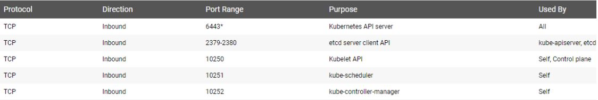
</div>

# __Worker Node__

<div align="left">
   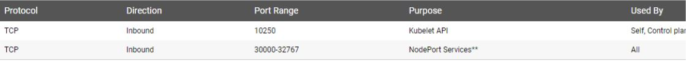
</div>

For our next trick, we'll be enabling the br_netfilter kernel module on all three servers. This is done with the following commands:
The network adapter on the hypervisor has to be set to Bridge and promiscuous mode.

```
modprobe br_netfilter
echo '1' > /proc/sys/net/bridge/bridge-nf-call-iptables
```

# __Enable br_netfilter__

```
cat <<EOF > /etc/sysctl.d/k8s.conf
net.bridge.bridge-nf-call-ip6tables = 1
net.bridge.bridge-nf-call-iptables = 1
EOF
```

# __Install Docker-ce__

### __It's time to install the necessary Docker tool. On all three machines, install the Docker-ce dependencies with the following command:__

```
yum install -y yum-utils device-mapper-persistent-data lvm2
```
### __Next, add the Docker-ce repository with the command:__
```
yum-config-manager --add-repo https://download.docker.com/linux/centos/docker-ce.repo
```
### __Install Docker-ce with the command:__
```
yum list docker-ce --showduplicates
yum install -y docker-ce-18.06.1.ce-3.el7
```
### __or run the following as not root user.__

```
wget -qO- https://get.docker.com/ | bash
```
*__Note:__*
__If you would like to use Docker as a non-root user, you should now consider adding your user to the "docker" group with something like:__

```
sudo usermod -aG docker your-user
```
### __If the docker version is not supported by kubernetes you can.__

```
yum downgrade -y docker-ce
yum install -y docker-compose or pip install docker-compose
systemctl enable docker && systemctl start docker
ls -la /var/run/docker.sock
```

vim /etc/docker/daemon.json
```
{ "group": "docker" }
{ "dns": ["8.8.8.8", "8.8.4.4"] }
```
```
docker info
```

*__Note:__* in case of errors to start the daemon remove /var/lib/docker.
```
rm -rf /var/lib/docker
```

# __Viewing log messages__

| Command                      |    Description                
 -----------------------------  |  ----------------------------
 journalctl | Show all collected log messages
 journalctl -u docker.service | See network service messages 
 journalctl -f | Follow messages as they appear 
 journalctl -k | Show only kernel messages


# __Install Kubernetes__

This is also done on all three servers. First, we need to create a repository entry for yum.
To do this, issue the command nano /etc/yum.repos.d/kubernetes.repo and then add the following contents:

```
cat <<'EOF' > /etc/yum.repos.d/kubernetes.repo
[kubernetes]
name=Kubernetes
baseurl=https://packages.cloud.google.com/yum/repos/kubernetes-el7-x86_64
enabled=1
gpgcheck=1
repo_gpgcheck=1
gpgkey=https://packages.cloud.google.com/yum/doc/yum-key.gpg
https://packages.cloud.google.com/yum/doc/rpm-package-key.gpg
EOF
```

### __Save and close that file. Install Kubernetes with the command:__

```
yum install -y kubelet kubeadm kubectl
```

*__Note:__* yum error – Public key for *.rpm is not installed yum install {package-name} --nogpgcheck
Once the installation completes, reboot all three machines. As soon as each machine has rebooted, log back in and su- to the root user.

### __The bash-completion package which is not installed by default.__

```
yum install bash-completion -y
```
### __Setup autocomplete in bash into the current shell, bash-completion package should be installed first.__

```
source <(kubectl completion bash)
```
### __Setup autocompletes in bash into the current shell, bash-completion package should be installed first.__
```
echo "source <(kubectl completion bash)" >> ~/.bashrc
```
### __Kops is an interactive suit provided by kubernetes maintainer to do a bit more of manual work for (AWS). it only requires kubectl installed:__

```
curl -LO https://github.com/kubernetes/kops/releases/download/ \
$(curl -s https://api.github.com/repos/kubernetes/kops/releases/latest | \
grep tag_name | cut -d '"' -f 4)/kops-linux-amd64 \
chmod +x kops-linux-amd64 \
sudo mv kops-linux-amd64 /usr/local/bin/kops
```

# __Cgroup changes__

Now we need to ensure that both Docker-ce and Kubernetes belong to the same control group (cgroup). By default, Docker should already belong to cgroupfs(you can check this with the command docker info | grep -i cgroup).
### __To add Kubernetes to this, issue the command:__
```
sed -i 's/cgroup-driver=systemd/cgroup-driver=cgroupfs/g'
/etc/systemd/system/kubelet.service.d/10-kubeadm.conf
```
### __Configure cgroup driver used by kubelet on Master Node:__

```
sed -i "s/cgroup-driver=systemd/cgroup-driver=cgroupfs/g" /var/lib/kubelet/kubeadm-flags.env
```

### __Restart the systemd daemon and the kubelet service with the commands:__

```
systemctl daemon-reload
systemctl enable kubelet.service
systemctl restart kubelet
```
### __Show kubernetes version in json format:__
```
kubectl version -o json
```

# __Initialize the Kubernetes cluster__

We're now ready to initialize the Kubernetes cluster. This is done on kubemaster (and only on that machine).
Onkubemaster, issue the command (again, adjusting the IP addresses to fit your needs):

### __1. Initializes cluster master node:__
```
kubeadm init --apiserver-advertise-address $(hostname -i)
```

### __2. Initialize cluster networking:__
  
  - For [--apiserver-advertise-address] option, specify the IP address Kubernetes API server listens.
  - For [--pod-network-cidr] option, specify network which Pod Network uses.
  - There are some plugins for Pod Network.
   (refer to details below) https://kubernetes.io/docs/concepts/cluster-administration/networking/
   - In this example, select Flannel. For Flannel, specify [--pod-network-cidr=10.244.0.0/16] to let Pod Network work normally.

### __Calico pod network uses 192.168.0.0/16 and Flannel pod network uses 10.244.0.0/16__

```
kubeadm init --apiserver-advertise-address=`hostname -i` --pod-network-cidr=10.244.0.0/16
```
When this completes (it'll take anywhere from 30 seconds to 5 minutes), the output should include the joining command for your nodes.

<div align="left">
   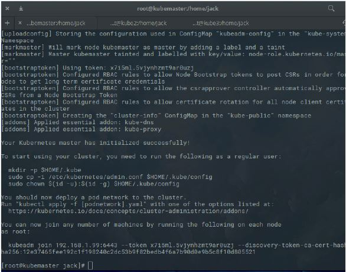
</div>

Run the kubeadm join on the nodes to add them to the cluster as shown above.

# __Configuring Kubernetes__
Before Kubernetes can be used, we must take care of a bit of configuration.
Issue the following three commands (to create a new .kube configuration directory,
copy the necessary configuration file, and give the file the proper ownership):
*__Note:__* You should run these command as a regular user.

```
mkdir -p $HOME/.kube
sudo cp -i /etc/kubernetes/admin.conf $HOME/.kube/config
sudo chown $(id -u):$(id -g) $HOME/.kube/config
```
```
vim ~/.kube/config
```

# __Install the Pod network:__

### __Now we must select your pod network to be deployed on the cluster with the command:__

```
kubectl apply -f https://raw.githubusercontent.com/coreos/flannel/master/Documentation/kube-flannel.yml
```
### __Calico Pod Network:__

```
kubectl apply -f https://docs.projectcalico.org/v1.5/getting-started/kubernetes/installation/hosted/kubeadm/calico.yaml
```
### __Weave Pod Network:__

```
kubectl apply -n kube-system -f "https://cloud.weave.works/k8s/net?k8s-version=$(kubectl version | base64
|tr -d '\n')"
```

*__Reference:__* https://kubernetes.io/docs/setup/independent/create-cluster-kubeadm/#pod-network

### __Control plane node isolation__

By default, your cluster will not schedule pods on the master for security reasons. If you want to be able to schedule pods on the
master, e.g.
for a single-machine Kubernetes cluster for development, run:
kubectl taint nodes --all node-role.kubernetes.io/master-

In case of network issues you can start from scratch: To undo what kubeadm did, you should first drain the node and make sure that

### __The nodes have empty before shutting it down:__

```
kubectl get nodes
```
```
kubectl drain kubemaster --delete-local-data --force --ignore-daemonsets
```
```
kubectl delete node kubemaster
```
```
kubeadm reset
```

# __Deploying Dashboard__

### __Create the Dashboard service__
```
kubectl create -f https://raw.githubusercontent.com/kubernetes/dashboard/master/src/deploy/recommen
ded/kubernetes-dashboard.yaml
```

### __Create a service account called dashboard in namespace default__
```
kubectl create serviceaccount dashboard -n default
```
```
kubectl create clusterrolebinding dashboard-admin -n default --clusterrole=cluster-admin
--serviceaccount=default:dashboard
```
### __Get a token to authenticate on the Dashboard:__

```
kubectl get secret $(kubectl get serviceaccount dashboard -o jsonpath="{.secrets[0].name}") -o jsonpath="{.data.token}" | base64 --decode
```

### __Get all the tokens on the cluster__
```
kubectl -n kube-system describe secret $(kubectl -n kube-system get secret | grep kubernetes-admin
| awk '{print $1}')
```
### __Edit the dashboard config to make it accessible publically:__

  - Change type: 
     * ClusterIP to type:
     * NodePort
```
kubectl -n kube-system edit service kubernetes-dashboard
```

### __Kubernetes API server is exposed and accessible from outside you can directly access dashboard at:__
```
https://<master-ip>:<apiserver-port>/api/v1/namespaces/kube-system/services/https:kubernetes-dashboard:/proxy/
```
### __How to get the service account in yaml format:__

```
kubectl get serviceaccounts dashboard -o yaml
```
### __How to get the token of the service account__
```
kubectl get secret dashboard-token-pslw7 -o yaml
```
### __Make the dashboard accessible on hostname ip and port 443 you are able to skip access security.__

```
kubectl proxy --address=`hostname -i` -p 443 --accept-hosts='^*$' &
```
### __Deploy rancher dashboard manager:__
```
docker run -d --restart=unless-stopped --name rancher -p 80:80 -p 443:443 rancher/server:latest
```

# __Master server__

You may access the UI directly via the Kubernetes master API server. Open a browser and navigate to:
Get the access to URL for the dashboard
### __Creates a proxy server or application-level gateway between localhost and the Kubernetes API Server.__

```
kubectl proxy & kubectl port-forward <pod name> [Local_port: Remote_port]
```
```
curl localhost:8001
```
However, I want to be able to hit it remotely with my desktop’s web browser since kubectl proxy enables only access to localhost.
Using putty, I created an ssh tunnel to map my local 8001 port to port 8001 on my master node kube.

<div align="centre">
   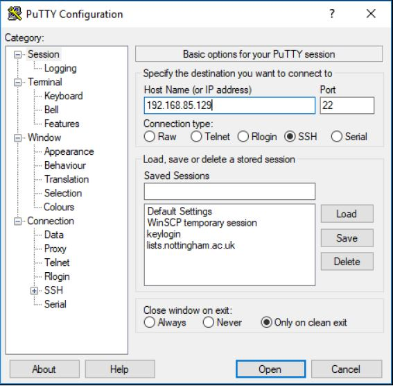
</div>

<div align="centre">
   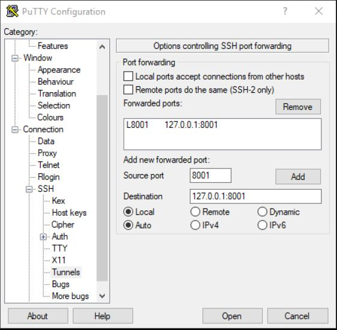
</div>

### __After authenticating browse to:__

```
http://127.0.0.1:8001/api/v1/namespaces/kube-system/services/https:kubernetes-dashboard:/proxy/#!/login
```

### __Get the token and paste it on the dashboard:__

```
kubectl get secret $(kubectl get serviceaccount dashboard -o jsonpath="{.secrets[0].name}") -o
jsonpath="{.data.token}" | base64 --decode
```
<div align="centre">
  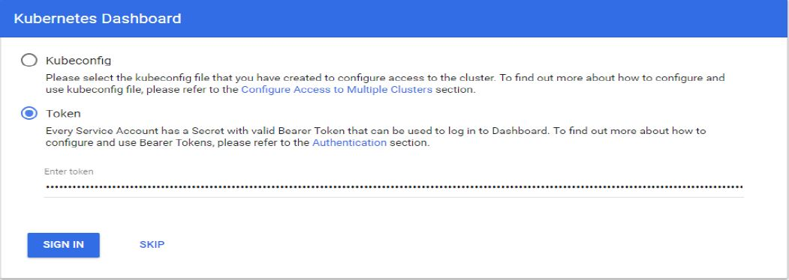
</div>

### __Now I can start up the kubectl proxy to access the dashboard.__

```
kubectl proxy
```
### __To access the dashboard on a different ip address and port:__

```
kubectl proxy --address `hostname -i` --port 8050 --accept-hosts= `hostname -i` &
```
```
kubectl --kubeconfig ${HOME}/.
```
```
kube/config proxy --port 8050 --address='192.168.85.129'
```
```
curl 192.168.85.129:8050
```
*__Note:__* You may encounter "Unauthorized".

### __If you need to kill the process__
```
pkill -9 kubectl
```
```
kubectl cluster-info
```
### __Kubectl will handle authentication with API server and make Dashboard available at:__
```
https://<master-ip>:<apiserver-port>/api/v1/namespaces/kube-system/services/https:kubernetes-dashboard:/proxy/#!/login
```
Where <master-ip> is IP address or domain name of the Kubernetes master.
port:8050

*__Note:__* The UI can only be accessed from the machine where the command is executed. See kubectl proxy --help for more options.
If the username and password are configured but unknown to you, then use the following to find it:

```
kubectl config view
```
### __Get the logs from the dashboard pod__
```
kubectl get pods -o wide --all-namespaces
```
```
kubectl -n kube-system logs kubernetes-dashboard-77fd78f978-n7zvd
```
# __Join nodes to the cluster__

### __Once that completes, head over to kube2 and issue the command (adjusting the IP address to fit your needs):__

```
kubeadm join 192.168.1.99:6443 --token TOKEN --discovery-token-ca-cert-hash DISCOVERY_TOKEN
```
Where TOKEN and DISCOVERY_TOKEN are the tokens displayed after the initialization command completes.
*__Note:__* Make sure that you deployed the dashboard before joining the nodes so the dashboard is hosted on the master.
If you do it after the dashboard gets hosted on the nodes.

# __Checking your nodes__
### __Once the deploy command completes, you should be able to see both nodes on the master, by issuing the command kubectl get nodes.__

```
kubectl get nodes
```

<div align="centre">
  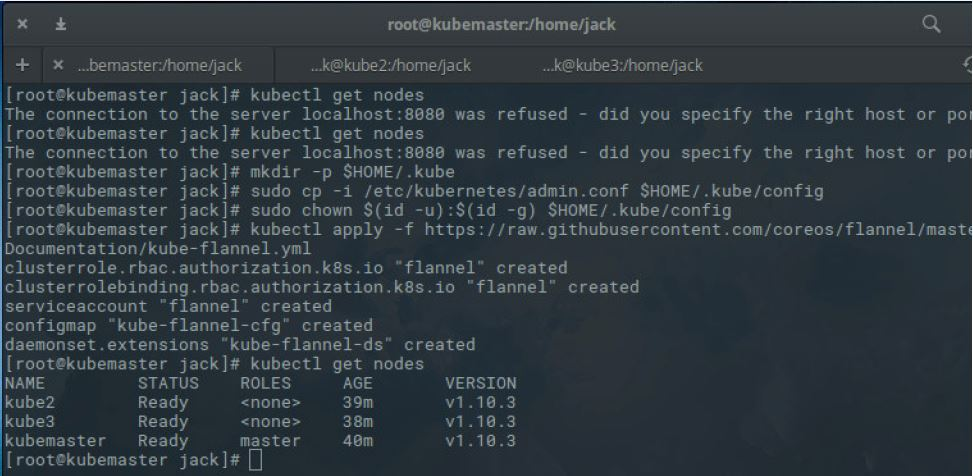
</div>

# __Managing pods and Containers__

### __Verify the health of the cluster:__

```
kubectl get cs
```

### __Shows all resources type:__

```
kubectl get all
```

# __What are these different things?__

|                  Kind                 |    apiVersion                      |
|---------------------------------------|------------------------------------|
|     Pod                               |     v1                             |
|     Replication Controller            |     V1                             |
|     Service                           |     v1                             |
|     ReplicaSet                        |     apps/v1                        |
|     Deployment                        |     apps/v1                        |
|     DaemonSet                         |     app/v1                         |
|     Job                               |     batch/v1                       |

  - A deployment is a high-level construct
    * Allows scaling, rolling updates, rollbacks.
    * Multiple deployments can be used together to implement a canary deployment.
    * Delegates pods management to replica sets.  
  - A replica set is a low-level construct.
    * Makes sure that a given number of identical pods are running.
    * Allows scaling.
    * Rarely used directly.
  - A Replication Controller is the (deprecated) predecessor of a Replica Set

### __Verify if nodes were created:__

```
kubectl get nodes -o=wide
```

### __Verify if pods were created; understanding pods life cycle:__

<div align="centre">
  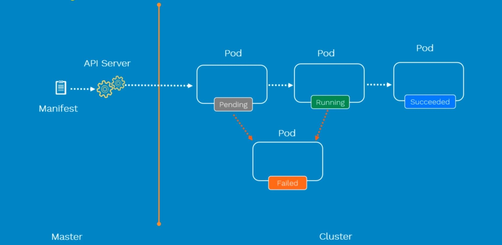
</div>

```
kubectl get pods -o wide --all-namespaces
```

### __Verify the system namespace:__

```
kubectl -n kube-system get pods -o wide
```
### __Verify if deployments were created:__

```
kubectl get deployments -o wide --all-namespaces
```

### __Verify if services were created:__

```
kubectl get service -o wide --all-namespaces
```
### __Provides the manual for the command specified:__

```
kubectl explain namespaces
```
### __Replication Controller vs Replica Set__
Replication controller and Replica set ensures that pods are available at all times.
The differences between the two is that Replication Controller uses equlity-based selector and the other set-based.

|  Equality-based      |  Set-based                                                     |
|----------------------|----------------------------------------------------------------|
|  operators           |  opertors                                                      |
|  =  ==  !=           |  in notin   exists                                             |
|  selector:           |  selector:                                                     |
|    env: prod         |    matchExpressions:                                           |
|     tier: frontend   |     - {key:env, operator: in, values: [prod, qa]}              |
|                      |     - {key:tier, operator: Notin, values: [frontend, backend]} |

 * For Replication Controller
```
kubectl get po -l env=prod
```
  * For Replica Set
```
kubectl get po -l 'env in (prod)'
```

<div align="centre">
  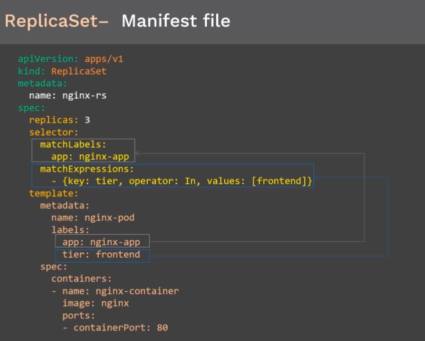
</div>

# __1. Deploys new container with replication equal 2, using nginx image and open port 80 in the cluster:__

```
kubectl run test-nginx --image=nginx --replicas=2 --port=80
```
  * Easyway to get started  
  * Versatile

```
kubectl create <resource>
```
  * Explicit, but lacks some features  .
  * Can't create a CronJob.
  * Can't pass command-line arguments to deployments.

```
kubectl apply -f https://raw.githubusercontent.com/kubernetes/website/master/content/en/examples/application/nginx-app.yaml
```
Or
```
kubectl create -f foo.yaml
```

*__Note:__* kubectl run --restart=OnFailure or kubectl run --restart=Never all features are available

# __2. Display information about the Deployment:__

```
kubectl get deployments test-nginx
```
### __View status of the rollout:__

```
kubectl rollout status deployment <deployment-name>
```
### __Set the image of a deployment or upgrade the deployment:__

```
kubectl set image deployment/<deployment-name> container-name=image-name:version
```

### __Get the current image tag of the prod pod__
```
kubectl get po -n namespace `kubectl get po -n namespace | grep pod-name-search | gawk -F ' ' '{ print $1 }'` -o yaml | grep image 
```
### __Set the image of a deployment or upgrade the deployment with automatic rollback in case of failing:__
```
kubectl -n namespace set image deployment/deployment-name image:tag --record
```

### __Watch the rollout and wait for 5 mins before declaring an issue:__
```
kubectl -n namespace rollout status deployment deployment-name --watch=true --timeout=300s 
```
### __View the history of a rollout, including previous revisions:__

```
kubectl rollout history deployment/deployment-name
```
```
kubectl rollout history deployment/deployment-name --revision=<revision number>
```
```
kubectl describe deployments test-nginx
```
### __Recovering from a bad rollout__

```
kubectl rollout undo deploy test-nginx
```
### __Restart the deployment__
```
kubectl -n drone rollout restart deployment <deployment-name>
```
# __3. Display information about your ReplicaSet objects:__

```
kubectl get replicasets
```
or 
```
kubectl get rs test-nginx -o wide
```
```
kubectl describe replicasets
```

# __4. Create a Service object that exposes the deployment to the outside world:__
### __Deployment Types:__
  * Recreate
  * RollingUpdate (Ramped or incremental) (default)
  * Canary
  * Blue / Green

```
kubectl expose <type name> <identifier/name> [--port=external port] [--target-port=container-port][--type=service-type]
``` 
```
kubectl expose deployment test-nginx --type=NodePort --name=my-service
```
```
kubectl expose deployment test-nginx --type=LoadBlancer --port=80 --targetport=80 --name=my-service-loadbalancer
```

# __Basic service types__

*__ClusterIP:__* __(default type) Exposes the service on a cluster-internal IP. Choosing this value makes the service only reachable from within the cluster. This is the default ServiceType.__
  * A virtual IP address is allocated for the service (in an internal, private range)  
  * This IP address is reachable only from within the cluster (nodes and pods)  
  * Our code can connect to the service using the original port number.

*__NodePort:__* __Exposes the service on each Node’s IP at a static port (the NodePort). A ClusterIP
service, to which the NodePort service will route, is automatically created. You’ll be able to
contact the NodePort service, from outside the cluster, by requesting <NodeIP>:<NodePort>.__

  * A port is allocated for the service (by default, in the 30000-32768 range).
  * That port is made available on all our nodes and anybody can connect to it.
  * Our code must be changed to connect to that new port number.

*__LoadBalancer:__* __Exposes the service externally using a cloud provider’s load balancer. NodePort and ClusterIP services, to which the external load balancer will route, are automatically created.__

  * An external load balancer is allocated for the service.  
  * The load balancer is configured accordingly. (e.g.: a NodePort service is created, and the load balancer sends traffic to that port).
  * Available only when the underlying infrastructure provides some "load balancer as a service" (e.g. AWS, Azure, GCE, OpenStack...)

*__ExternalName:__* __Maps the service to the contents of the externalName field (e.g. foo.bar.example.com), by returning a CNAME record with its value. No proxying of any kind is set up. This requires version 1.7 or higher of kube-dns.__  

  * The DNS entry managed by CoreDNS will just be a CNAME to a provided record  
  * No port, no IP address, no nothing else is allocated  

# __5. Display information about the Service:__

```
kubectl get services my-service
```

<div align="left">
   
</div>

*__NOTE:__* If the external IP address is shown as <pending>, wait for a minute and enter the same command again.

# __6. Display detailed information about the Service:__
### __Debugging Pods__

```
kubectl describe pods ${POD_NAME}
```

### __Debugging Services__

```
kubectl describe service my-service
```

<div align="left">
   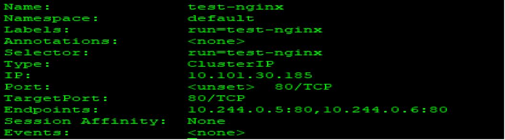
</div>

__Endpoints:__ Which shows us the IPs of the pods available to answer service requests.

```
kubectl get endpoints ${SERVICE_NAME}
```
### __Debugging Replication Controllers__

```
kubectl describe rc ${CONTROLLER_NAME}
```
```
kubectl get can output JSON, YAML, or be directly formatted
```
```
kubectl get nodes -o json | jq ".items[] | {name:.metadata.name} + .status.capacity"
```
```
kubectl get no -o yaml
```

# __7. In the preceding output, you can see that the service has several endpoints: 10.244.0.5:80,10.244.0.6:80. These are internal addresses of the pods that are running the test-nginx application.__ 

### __To verify these are pod addresses, enter this command:__

```
kubectl get pods --output=wide
```
# __8. Use the external IP address (LoadBalancer Ingress) to access the test-nginx application:__

*__Note:__* Obtain the IP address that was allocated for our service, programmatically:
```
IP=$(kubectl get svc my-service -o go-template --template '{{ .spec.clusterIP }}')
```
```
curl http://exteranl-ip-cluster:port
```

# __9. Show environment variable for [test-nginx] pod__

```
kubectl exec test-nginx-c8b797d7d-mzf9h env
```
### __Shell access to [test-nginx] pod__

```
kubectl exec -it test-nginx-c8b797d7d-mzf9h bash
```
### __Show logs of [test-nginx] pod__
```
kubectl logs type/name --tail 1 --follow
```
or
```
kubectl logs test-nginx-c8b797d7d-mzf9h
```
### __Scale PODS__

```
kubectl scale deployment test-nginx --replicas=3
```

### __Scale a resource specified in "test-nginx.yaml" to 3__

```
kubectl scale --replicas=3 -f test-nginx.yaml
```

- *__Auto scale a deployment "test-nginx":__*  

    _--max The upper limit for the number of pods that can be set by the autoscaler. Required._    
    _--min The lower limit for the number of pods that can be set by the autoscaler. If it's not specified or negative, the server will apply a default value._  
    _--cpu-percent The target average CPU utilization (represented as a percent of requested CPU) over all the pods. If it's not specified or negative, a default autoscaling policy will be used._  
  
```
kubectl autoscale deployment test-nginx --min=2 --max=10 --cpu-percent=90
```
### __Check status of the autoscale__

```
kubectl get hpa
```
### __Create service for existing Pods, a service is a stable address for a pod (or bunch of pods)__

```
kubectl expose deployment test-nginx --type="NodePort" --port 80
```
```
kubectl get services test-nginx
```

# __10. Cleaning up__

### __Delete service__

```
kubectl delete services my-service
```
### __To delete the Deployment, the ReplicaSet, and the Pods that are running the test-ngnix application, enter this command:__

```
kubectl delete deployment test-nginx
```
### __Delete pods and services with label name=myLabkubectldelete pods, services -l name=myLabel__

```
kubectl delete pods,services -l name=myLabel
```

### __Delete a pod using the type and name specified in pod.json__

```
kubectl delete -f ./pod.json
```
### __Delete the autoscale deployment__

```
kubectl delete horizontalpodautoscalers.autoscaling test-ngnix
```

# __Deploying a self-hosted registry__

* ### __Create the registry service:__
```
kubectl create deployment registry --image=registry:2
```

* ### __Expose the registry service to a service type NodePort:__
```
kubectl expose deploy/registry --port=5000 --type=NodePort
```

* ### __View the service details:__
```
kubectl describe svc/registry
```

* ### __Get the port number programmatically:__
```
NODEPORT=$(kubectl get svc/registry -o json| jq.spec.ports[0].nodePort)
export REGISTRY=127.0.0.1:$NODEPORT
curl localhost:$NODEPORT
```
### __Test the registry by pushing an image into the registry:__
```
docker pull busybox
```
```
docker tag busybox $REGISTRY/busybox
```
```
docker push $REGISTRY/busybox
```
* ### __View the repositories currently held in our registry:__

```
curl $REGISTRY/v2/_catalog
```

# __Deploy the NGINX container to the cluster__
### __It's now time to deploy the NGINX container. From the master node, issue the command:__
```
sudo kubectl create deployment nginx --image=nginx
```
### __Next we make the NGINX container available to the network with the command:__
```
sudo kubectl create service nodeport nginx --tcp=80:80
```

*__Note:__* Issue the command kubectl get svc to see your NGINX listing (as well as the assigned port, given by Kubernetes )

```
kubectl get svc
```
<div align="left">
   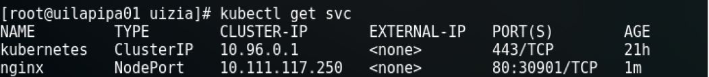
</div>

# __Use Persistent Storage in Kubernetes Cluster__
### __Define PV (Persistent Volume) object and PVC (Persistent Volume Claim) object on Master Node__

### __Create PV definition__
```bash
vim nfs-pv.yml
```

```
--- 
apiVersion: v1 
kind: PersistentVolume 
metadata: 
  # any PV name 
  name: nsf-pv 
spec: 
  capacity: 
    # storage size 
    storage: 20Gi 
  accessModes: 
    # ReadWriteMany(RW from multi nodes) 
    # ReadWriteOnce(RW from a node) 
    # ReadOnlyMany (R from multi nodes) 
    - ReadWriteMany 
  persistenVolumeReclaimPolicy: 
    # retain even if pods terminate 
    Retain 
  nfs: 
    # NFS server's definition 
    path: /var/lib/nfs-share 
    server: 10.0.0.30 
    readOnly: false 

```
```
---
apiVersion: v1
kind: PersistentVolume
metadata:
  name: local-pv-2
  labels:
    type: local
spec:
  capacity:
    storage: 20Gi
  accessModes:
    - ReadWriteOnce
  hostPath:
    path: /tmp/data/pv-2

```

```
kubectl create -f nfs-pv.yml
```
```
kubectl get pv
```
### __Create PVC definition__
```
vim nfs-pvc.yml
```
```
--- 
apiVersion: v1
kind: PersistentVolumeClaim
metadata:
  # any PVC name
  name: nsf-pvc
spec:
  accessModes:
    # ReadWriteMany(RW from multi nodes)
    # ReadWriteOnce(RW from a node)
    # ReadOnlyMany (R from multi nodes)
    - ReadWriteMany
  resources:
    requests:
      # storage size to use
      storage: 1Gi
    
``` 
```
---
apiVersion: v1
kind: PersistentVolumeClaim
metadata:
  name: wp-pv-claim
  labels:
    app: wordpress
spec:
  accessModes:
    - ReadWriteOnce
  resources:
    requests:
      storage: 20Gi
```

```
kubectl create -f nfs-pvc.yml
```
```
kubectl get pvc
```
```bash
vim nginx-nfs.yml
```

```
apiVersion: v1
kind: Pod
metadata:
  # any Pod name
  name: nginx-nfs
  labels:
    name: nginx-nfs
spec:
  containers:
   - name: nginx-nfs
     image: fedora/nginx
     ports:
       - name: web
       containerPort: 80
     volumeMounts:
       - name: nfs-share
         # mount point in container
         mountPath: /usr/share/nginx/html
  volumes:
   - name: nfs-share
     persistentVolumeClaim:
       # PVC name you created
       claimName: nfs-pvc

```
```
kubectl create -f nginx-nfs.yml
```
### __Expanding live disk in aws__
  #### __How to find the volumes used in elk with the namespace__
  ```
  kubectl -n elk get pvc kubectl -n elk describe pv pvc-01654715-bd5c-4e01-9e9a-7534a5fcad6d
  ```
  #### __How to find out if you could update the storage automatically look for allowVolumeExpansion= true__ 
  ```
  kubectl get sc ebs-gp2-plain-ext-sc -o yaml
  ```
  #### __How to resize the volume in yellow is highlighted an example below__
  ```
  kubectl -n elk edit pvc data-elk-elasticsearch-data-1
  ```
  #### __How to find if the volume was updated__
  ```
  kubectl -n elk describe pod elk-elasticsearch-data-1
  kubectl -n elk get pv | grep data-elk-elasticsearch-data 
  ```
  #### __How to access the container__
  ```
  kubectl -n elk get podkubectl -n elk exec -it elk-elasticsearch-data-0 -- sh
  df -h
  ```
### __Running NFS service on Swarm Mode__
```
docker service create --mount type=volume,volume-opt=o=addr=<source-host which is master node>, \
volume-opt=device=:<NFS directory>,volume-opt=type=nfs,source=<volume name>, \
target=/<insideContainer> --replicas 3 --name <service-name> dockerimage <command>
```

*__Reference:__* https://kubernetes.io/docs/concepts/storage/persistent-volumes/


# __Deployment with Yaml file__
## __Labels & Selectors__

### __Install git for this tutorial__
```
yum install -y git
```
```
git clone https://github.com/LevelUpEducation/kubernetes-demo.git
```

*__Note:__* Node selector is a property on a deployment that uses labels and selectors to chose which nodes the master decides to run a given pod on.

example:
```
kubectl get nodes
```
### __Set a label to a specific node__
```
kubectl label node <node name> storage=ssd
```
### __Update / apply changes__
```
kubectl apply -f ./tomcat-deployment.yaml
```

<div align="left">
   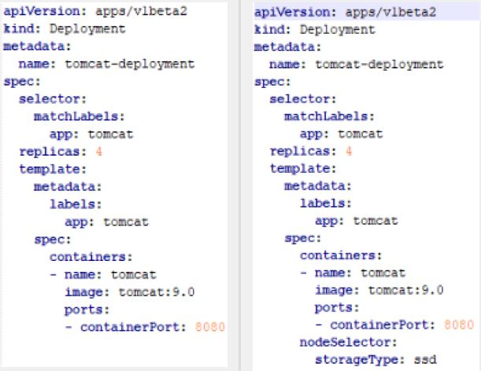
</div>

# __Health & Checks__
### __update / apply changes__
```
kubectl apply -f ./tomcat-deployment.yaml
```
### __Check for livenessProbe & readinessProbe__
```
kubectl describe deploment tomcat-deployment
```
## __RedinessProbe:__
   Determines when a pod is ready(after starting and loaded what it needs internally in the image and is ready to take request form external service).

## __LivelinessProbe:__
   Determines when the pod is Healthy or unhealthy after it becomes ready.

<div align="left">
   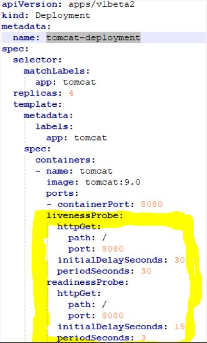
</div>

# __Secret__
### __Create a secret password__
```
kubectl create secret generic mysql-pass --from-literal=password=AMuchBetterWayToStoreAPassword
```
### __Check the secret was created__
```
kubectl get secrets
```

### __Update the deployment with the secret__

<div align="left">
   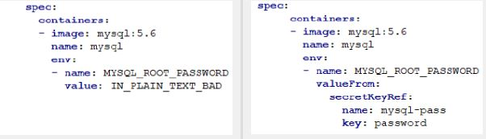
</div>

```
kubectl apply -f mysql-deployment.yaml
```
```
kubectl apply -f wordpress-deployment.yaml
```
```
kubectl describe deployments wordpress
```

# __Namespaces and resources quotas__
### __Create a namespace__
```
kubectl create namespace cpu-limited-tomcat
```
```
kubectl get namespaces
```
### __Create the resource quota__
```
kubectl create -f cpu-limits.yaml -n cpu-limited-tomcat
```

*__Note:__* 400m is 40 %cpu usage

### __Check the Resource Quota was created__
```
kubectl get ResourceQuota -n cpu-limited-tomcat -o yaml
```
### __Create tomcat deployment on the new namespace__
```
kubectl -n cpu-limited-tomcat apply -f tomcat-deployment.yaml
```
<div align="left">
   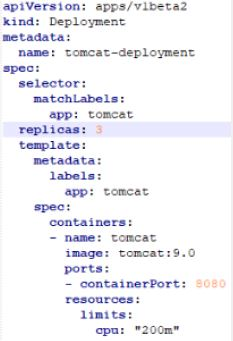
</div>

*__Note:__* This quota means that each replica consumes 200m, so 3 replicas consume 60%cpu.

### __Check status of the deployment__
```
kubectl describe deploy -n cpu-limited-tomcat
```
# __DNS as Service Discovery in Kubernetes__
```
<my-service-name>.<my-namespace>.svc.cluster.local

```

# __Auto Scaling__
```
kubectl apply -f wordpress-deployment.yaml
```
```
kubectl autoscale deploy wordpress --cpu-percent=50 --min=1 --max=5
```

### __Create a load for the service__
```
kubectl run -it load-generator --image=busybox /bin/sh
```

```bash
while true; do wget -q -O- http://wordpress.default.svc.cluster.local; done
```
### __Check the status of the autoscale__
```
kubectl get hpa
```

### __Delete the autoscale deployment__
```
kubectl delete horizontalpodautoscalers.autoscaling wordpress
```


# __Install the AWS Command Line Interface in a Virtual Environment__

### __1. Install virtualenv with pip.__
```
pip install --uservirtualenv
```
### __2. Create a virtual environment.__
```
virtualenv ~/cli-ve
```
*__Note:__* You can use the -p option to use a Python executable other than the default.
```
python3 --version
```
```
virtualenv -p /usr/bin/python3.4 ~/cli-ve
```
### __3. Activate the virtual environment.__
```
source ~/cli-ve/bin/activate
```
### __4. Install the AWS CLI.__
```
pip install --upgrade awscli
```
### __5. Verify that the AWS CLI is installed correctly.__
```
aws --version
```

# __Create an AWS S3 bucket as a state store__
```
aws
```
```
aws configure
```
search for the best region and press enter.

### __Create a bucket using the command line:__
```
aws s3api create-bucket --bucket basit-k8s-demo-bucket --region us-west-2 \
 --create-bucket-configuration LoactionConstraint=us-west-2
```

# __Create your access key in AWS.__
sign in the AWS Dashboard and click on your name at the top:

# __Setting up High Availability with kops__
### __Export your environment variables:__

```
export KOPS_SATATE_STORE=s3://basit-k8s-demo-bucket
```

### __HA multi nodes with kops__

```
kops create cluster basit-k8s-demo.k8s.local --zones us-west-2a, us-west-2b, us-west-2c \
--node-count 3 \
--master-zones us-west-2a, us-west-2b, us-west-2c --yes
```
### __Check the state of our cluster__
```
kops validate cluster
```
```
kubectl get nodes
```

### __Deploy the services in HA cluster__

```
kubectl apply -f mysql-deployment.yaml
```
```
kubectl apply -f workpress-deployment.yaml
```

### __Check the WordPress service and the loadbalance address provided by LBS.__

```
kubectl describe service workpress
```

*__Note:__* Check for loadbalancer ingress put the address on a browser to access WordPress.
Make sure that you deleted all the resources on the cluster.

```
kops delete cluster basit-k8s-demo.k8s.local --yes
```


# __kubernetes in production volumes on AWS (EBS)__
### __Export your environment variables:__

```
export KOPS_SATATE_STORE=s3://basit-k8s-demo-bucket
```
### __Create a single node master:__

```
kops create cluster basit-k8s-demo.k8s.local --zones us-west-2a --yes
```

### __Check the state of our cluster:__

```
kops validate cluster
```
### __Deploy the services in the cluster__
```
kubectl apply -f mysql-deployment.yaml
```
```
kubectl apply -f workpress-deployment.yaml
```
*__Note:__* notice that the pvc were created.

### __Get the persistent volumes__
```
kubectl get pv
```

### __Check the pv were created by the autoprovisioner automatically on EBS.__

```
kubectl describe pv
```

<div align="left">
   
</div>

### __Get the URL for the load balancer that is serving wordpress service__

```
kubectl describe service workpress
```
### __Check for loadbalancer ingress and put the address on a browser to access WordPress__

<div align="left">
   
</div>

### __Make sure that you deleted all the resources.__

```
kops delete cluster basit-k8s-demo.k8s.local --yes
```


# __Possible Solutions for deployment.__
  * Use kubectl command line to create a deployment, service and scale it.
  * Writing a deployment.yaml file, use kubectl apply, & use kubectl expose to expose a service.
  * Writing a deployment.yaml file & a service.yaml file and use kubectl apply on both.
  * Use a kubernetes manager like helm to handle the work for you.


***
# __Install OpenShift Origin__

|           10.0.1.10  |                  10.0.1.11   |                 10.0.1.12    |
|----------------------|------------------------------|------------------------------|
|[ctrl1.inecsoft.co.uk]|      [node01.inecsoft.co.uk] |      [node01.inecsoft.co.uk] |
|     (Master Node)    |          (Compute Node)      |          (Compute Node)      |
|     (Infra Node)     |                              |                              |
|     (Compute Node)   |                              |                              |


***
### __1. On All Nodes, Create a user for installation to be used in Ansible and also grant root privileges__
```
useradd origin
```
```
echo -e 'Defaults:origin !requiretty\norigin ALL = (root) NOPASSWD:ALL' | tee /etc/sudoers.d/openshift
```
```
chmod 440 /etc/sudoers.d/openshift
```
```
firewall-cmd --add-service=ssh --permanent
firewall-cmd --reload
```

### __2. On All Nodes, install OpenShift Origin 3.11 repository and Docker and packages needed__
```
yum -y install centos-release-openshift-origin311 centos-release-ansible-27
yum -y install ansible openshift-ansible docker git pyOpenSSL
```
```
systemctl enable --now docker
```
***

### __3. On Master Node, login with a user created above and set SSH keypair with no pass-phrase__
```
ssh-keygen -q -N ""
```

#### __Create a config in each node__
```
cat >> ~/.ssh/config <<EOL

Host ctrl
    Hostname ctrl.inecsoft.co.uk
    User origin
Host node01
    Hostname node01.inecsoft.co.uk
    User origin
Host node02
    Hostname node02.inecsoft.co.uk
    User origin
EOL    
```
```
chmod 600 ~/.ssh/config
```

### __Transfer public-key to other nodes__

```
ssh-copy-id node01
ssh-copy-id node02
ssh-copy-id ctl1
```
### __4. On Master Node, login with a user created above and run Ansible Playbook for setting up OpenShift Cluster.__
```
cat >> /etc/ansible/hosts <<EOL

# add follows to the end
[OSEv3:children]
masters
nodes
etcd

[OSEv3:vars]
# admin user created in previous section
ansible_ssh_user=origin
ansible_become=true
openshift_deployment_type=origin

# use HTPasswd for authentication
openshift_master_identity_providers=[{'name': 'htpasswd_auth', 'login': 'true', 'challenge': 'true', 'kind': 'HTPasswdPasswordIdentityProvider'}]
# define default sub-domain for Master node
openshift_master_default_subdomain=apps.inecsoft.co.uk
# allow unencrypted connection within cluster
openshift_docker_insecure_registries=172.30.0.0/16

[masters]
ctrl.inecsoft.co.uk openshift_schedulable=true containerized=false

[etcd]
ctrl.inecsoft.co.uk

[nodes]
# defined values for [openshift_node_group_name] in the file below
# [/usr/share/ansible/openshift-ansible/roles/openshift_facts/defaults/main.yml]
ctrl.inecsoft.co.uk openshift_node_group_name='node-config-master-infra'
node01.inecsoft.co.uk openshift_node_group_name='node-config-compute'
node02.inecsoft.co.uk openshift_node_group_name='node-config-compute'

EOF
```

#### __Prerequisites Playbook__
```
ansible-playbook --become-user origin /usr/share/ansible/openshift-ansible/playbooks/prerequisites.yml
```
#### __Deploy Cluster Playbook__
```
ansible-playbook --become-user origin /usr/share/ansible/openshift-ansible/playbooks/deploy_cluster.yml
```

### __Show state__
```
oc get nodes
```

### __Show state with labels__
```
oc get nodes --show-labels=true
```

### __5. Upgrade the cluster__

*__Note:__* Follow steps 1 to 3 then.

```
vim  /etc/ansible/hosts
# add new lines with the following
[OSEv3:children]
masters
nodes
new_masters

[new_masters]
ctl2.inecsoft.co.uk openshift_node_group_name='node-config-master'
```


#### __Run Scaleup Cluster Playbook__
```
ansible-playbook --become-user origin /usr/share/ansible/openshift-ansible/playbooks/prerequisites.yml
ansible-playbook --become-user origin /usr/share/ansible/openshift-ansible/playbooks/openshift-master/scaleup.yml
```
### __Show status__
```
oc get nodes --show-labels=true
```
```
vim  /etc/ansible/hosts
# add new lines with the following
[OSEv3:children]
masters
nodes


[masters]
ctl1.inecsoft.co.uk openshift_node_group_name='node-config-master'
ctl2.inecsoft.co.uk openshift_node_group_name='node-config-master'
```

### __Run Scaleout Node Playbook__
```
vim  /etc/ansible/hosts
# add new lines with the following
[OSEv3:children]
masters
nodes
new_nodes

[new_nodes]
node03.inecsoft.co.uk openshift_node_group_name='node-config-infra'
```
```
ansible-playbook --become-user origin /usr/share/ansible/openshift-ansible/playbooks/prerequisites.yml
ansible-playbook --become-user origin /usr/share/ansible/openshift-ansible/playbooks/openshift-node/scaleup.yml
```
### __Show status__
```
oc get nodes --show-labels=true
```
```
vim  /etc/ansible/hosts
# add new lines with the following
[OSEv3:children]
masters
nodes


[nodes]
node01.inecsoft.co.uk openshift_node_group_name='node-config-compute'
node02.inecsoft.co.uk openshift_node_group_name='node-config-compute'
node03.inecsoft.co.uk openshift_node_group_name='node-config-infra'
```

***
# __Install Minikube to configure Single Node Cluster within a Virtual machine.__

Because using VM, Install a Hypervisor which is supported by Minikube.
```
yum -y install qemu-kvm libvirt libvirt-daemon-kvm
```
```
systemctl start libvirtd
```
```
systemctl enable libvirtd
```
```
yum install -y wget
```
```
wget https://storage.googleapis.com/minikube/releases/latest/minikube-linux-amd64 -O minikube
```
```
wget https://storage.googleapis.com/minikube/releases/latest/docker-machine-driver-kvm2
```
```
chmod 755 minikube docker-machine-driver-kvm2
```
```
mv minikube docker-machine-driver-kvm2 /usr/local/bin/
```
```
export PATH=$PATH:/usr/local/bin
```
```
minikube version
```

### __To start minikube__
```
minikube start --vm-driver kvm2
```

### __show the status__

```
minikube status
```
```
minikube service list
```
```
minikube docker-env
```
```
kubectl get nodes
```
### __To see the VM that minikube is running.__
```
virsh list
```
### __To get access to the VM.__
```
minikube ssh
```
```
hostname
docker ps
exit
```
### __Deploy Grafana for monitoring.__
```
minikube addons enable haeapster
```
```
kubectl get pods -n=kube-system
```
```
minikube addons open heapster
```
*__Note:__* user and password is admin.

```
minikube stop
minikube delete
virsh list --all
```

# __How to upgrade kubernetes__

### __Now, you can easily check to see if your system can handle an upgrade by entering:__
```
kubeadm upgrade plan
```

### __After checking to see how an upgrade will affect your cluster, you can apply the upgrade by typing:__

```
kubeadm upgrade apply v1.13.2
```

*__Reference:__*

```
https://kubernetes.io/docs/tutorials/stateless-application/expose-external-ip-address/

https://github.com/LevelUpEducation/kubernetes-demo
```