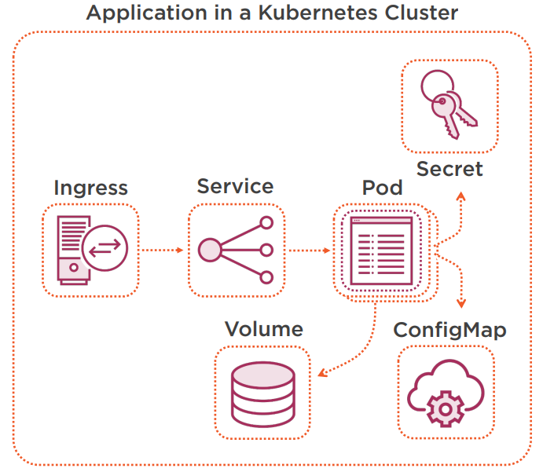

***

 <div align="center">
    
</div>

***

### __Requirements for kubenetes lab__
```
wget https://storage.googleapis.com/minikube/releases/latest/minikube-linux-amd64 -O minikube
```
```
wget https://storage.googleapis.com/minikube/releases/latest/docker-machine-driver-kvm2
```
```
chmod 755 minikube docker-machine-driver-kvm2
```
```
mv minikube docker-machine-driver-kvm2 /usr/local/bin/
```
```
export PATH=$PATH:/usr/local/bin
```
```
minikube version
```

### __To start minikube__
```
minikube start --driver=docker
minikube addons enable ingress
minikube ip
cat << EOF >> /etc/hosts
`minikube ip` frontend.minikube.local
`minikube ip` backend.minikube.local
EOF

minikube kubectl -- get pods -A
```

### __show the status__

```
minikube status
```
```
minikube service list
```
```
minikube docker-env
```
```
kubectl get nodes
```

### __Deploy Grafana for monitoring.__
```
minikube addons enable haeapster

```
```
kubectl get pods -n=kube-system
```
```
minikube addons open heapster
```
*__Note:__* user and password is admin.

```
minikube stop
minikube delete
***
### __Installing helm__
```
curl https://baltocdn.com/helm/signing.asc | sudo apt-key add -
sudo apt-get install apt-transport-https --yes
echo "deb https://baltocdn.com/helm/stable/debian/ all main" | sudo tee /etc/apt/sources.list.d/helm-stable-debian.list
sudo apt-get update
sudo apt-get install helm
```
***