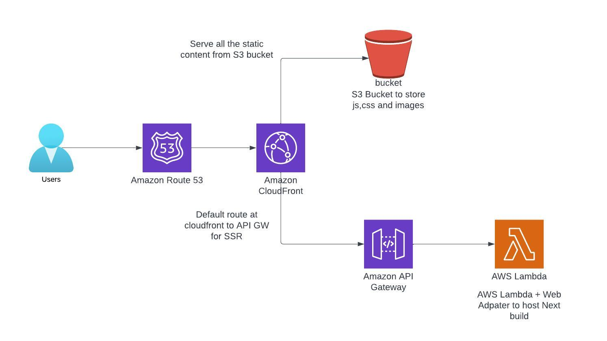

---
<div align="center">

</div>
---

### **Install pre-commit**

```
pre-commit install
```

### **Run hooks**

```
pre-commit run -a
```

### **Setting up NextJS app for standalone deployment**

```
npx create-next-app@latest

yarn create next-app
```

### **Open the next.config.js file and add the following code:**

```

const version = process.env.BUILD_VERSION
/** @type {import('next').NextConfig} */
const nextConfig = {
  reactStrictMode: true,
  output: "standalone",
  assetPrefix: `https://next-app-images.s3.eu-west-1.amazonaws.com/${version}`,
  images: {
    unoptimized: true,
  },
};
module.exports = nextConfig;
}
```

By setting output to standalone, Next.js can automatically create a standalone folder that copies only the necessary files for a production deployment, including select files in node_modules.

The assetPrefix property should be set to the URL of your desired CDN. By doing so, your Next.js app will utilize the CDN to serve static files, resulting in improved performance and faster load times for your users.

Remember to replace <CDN_URL> with the actual URL of your CDN. Once you've made these changes, your Next.js application will be ready for deployment using AWS Lambda and a CDN.

### **upload.sh script:**

```
#!/bin/bash -e
aws s3 cp ./.next/static s3://next-app-images/${BUILD_VERSION}/_next/static --recursive
```

### **To deploy the app, execute the deploy.sh bash script with argument deploy.**

```
./deploy.sh deploy
```

### **To just sync files to Lambda and S3, execute the deploy.sh bash script with argument sync.**

```
./deploy.sh sync
```

### **To destroy the deployment, navigate to the nextjs-lambda/ folder and run:**

```
terraform destroy
```

### **Ref:**

```
https://annleefores.com/blog/run-nextjs-on-lambda
```
