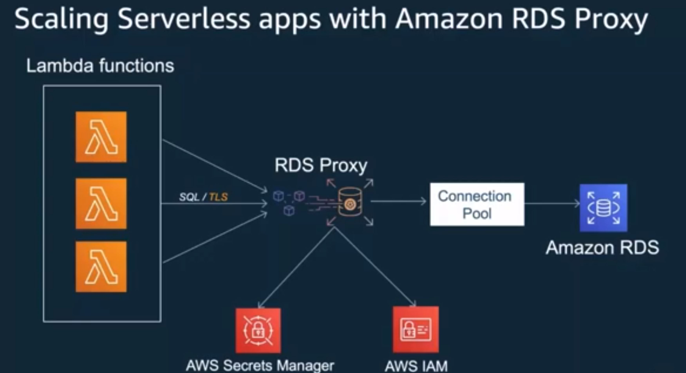
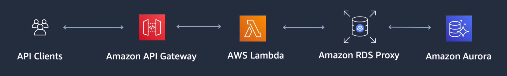
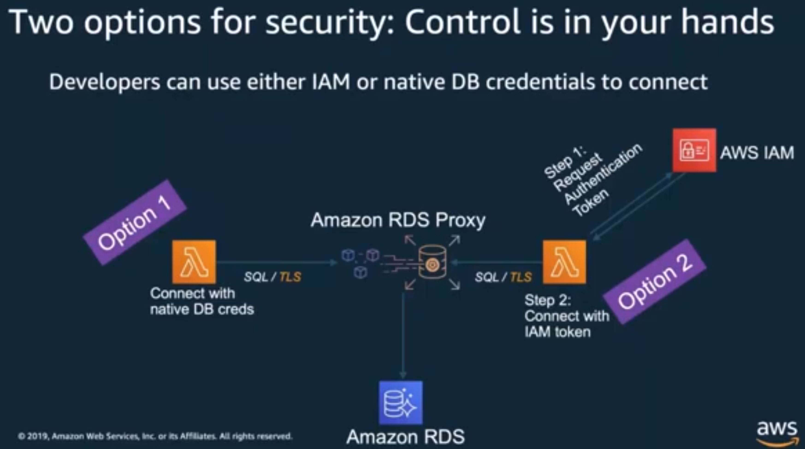

***

 <div align="center">
    
</div>

***

<div align="center">
    
</div>
***

<div align="center">
    
</div>

***
### __Workshop on Rest Api Gateway, lambda, proxy and RDS__
    
    * Instead of connecting directly to the RDS instance, connect to the RDS proxy endpoint. To do this, you
       have two options for security. You can use IAM authentication or you can use your native database
       credentials stored in Secrets Manager. IAM authentication is recommended because it removes the need
       to embed or read credentials in your function code. This guide uses IAM authentication to your RDS
       Proxy.  

    * RDS Proxy helps you manage a large number of connections from Lambda to an RDS database by establishing
       a warm connection pool to the database. Your Lambda functions can scale to meet your needs and use the
       RDS Proxy to serve multiple concurrent application requests. This reduces the CPU and Memory
       requirements for your database, and eliminates the need for connection management logic in your code.
       Finally, please   review the pricing details for RDS Proxy.  

***
```
aws rds describe-db-proxies --query '*[*].{DBProxyName:DBProxyName,Endpoint:Endpoint}'
mysql -h the-proxy.proxy-demo.us-east-1.rds.amazonaws.com -u admin_user -p
Enter password:
...

mysql> select @@aurora_server_id;
+--------------------+
| @@aurora_server_id |
+--------------------+
| instance-9814      |
+--------------------+
1 row in set (0.01 sec)
```

***