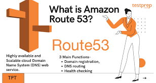

***

 <div align="center">
    <h1>Welcome to Route53 for Inecsoft</h1>
    
</div>

***
# __dcs-route53-domains__
***

### __How to test records__

```
dig @8.8.8.8 txt inecsoft.co.uk
```
***
### __How to update contact in domain__

```
aws route53domains update-domain-contact \
    --region us-east-1 \
    --cli-input-json file://update-domain-contact.json

```

```
for i in `aws route53domains list-domains  --region us-east-1 | jq '.Domains | .[].DomainName'| tr -d '"'`;
  do jq --arg i $i -r  '.DomainName=$i' update-domain-contact.json >update-domain-contact-process.json;
  aws route53domains update-domain-contact --region us-east-1 --cli-input-json file://update-domain-contact-process.json;
  sleep 5;
  echo $i;
done;
```

__Note:__ check the domain contact details


### __To automatically update the Nameservers__

```
for i in `cat domain.txt`; do record=`echo $i |  tr '.' '_'` ; 
echo aws_route53_zone.${record}_zone.name_servers | terraform console > records;
sed -e '1d;6d' records | tr -d '"' | tr -d ','| tr -d ' ';
ns=(`sed -e '1d;6d' records | tr -d '"' | tr -d ','| tr -d ' '`);
export ns1=${ns[0]} ns2=${ns[1]} ns3=${ns[2]} ns4=${ns[3]};
echo $i;
aws route53domains update-domain-nameservers --region us-east-1 --domain-name $i --nameservers Name=$ns1 Name=$ns2 Name=$ns3 Name=$ns4
done
```

### __How to get privacy set up__
```
for i in `aws route53domains list-domains  --region us-east-1|jq '.Domains | .[].DomainName'| tr -d '"'`;
 do aws route53domains update-domain-contact-privacy --region us-east-1  --domain-name $i --admin-privacy  --registrant-privacy --tech-privacy;
 sleep 10;
done;  
```
```
aws route53domains  get-domain-detail  --region us-east-1  --domain-name inecsoft.co.uk
```

```
aws route53domains list-domains  --region us-east-1 | jq '.Domains | .[] | .DomainName'
```
***