***

   <h1>SCRUM FRAMEWORK</h1>
   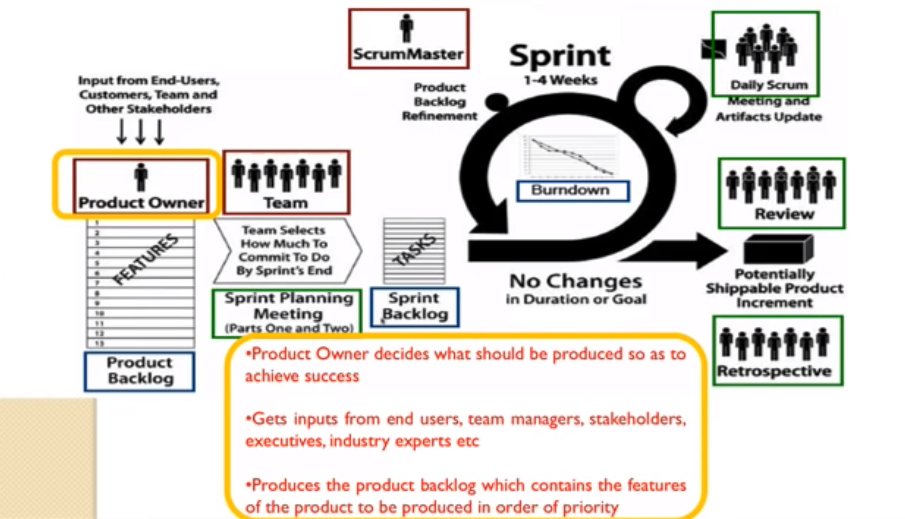

***

   <h1>SCRUM Sumary</h1>

   
   - It is an iterative, incremental framework
    Sprints:
        * cycles of work developed
        * duration 2-4 weeks
        * one ofter another without pause
   - Time boxed - they end whether or not the work ends
   - At the beinning, cross-sunctional team forms the priority list based on customer requirements.4
   - During the sprint the chosen items do not change
   - Everyday instpection and adjustment
   - End or the sprint, review with stakeholders
   - FreedBacks are taken and incorporated into the sprint
   - End of sprint, fully tested product is formed as per customer requirests

***

   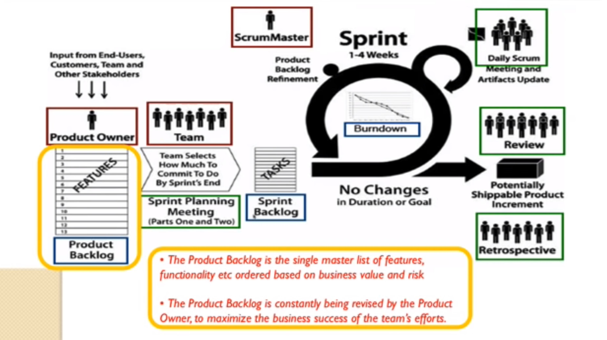

***

   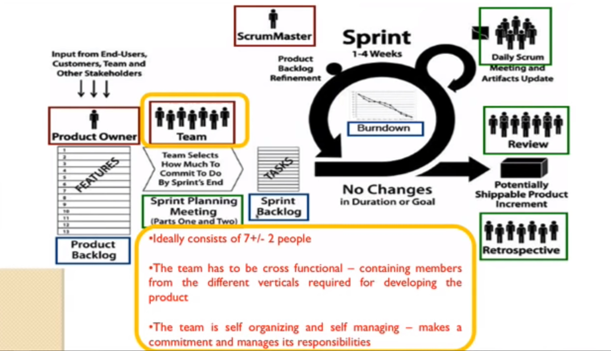

***

   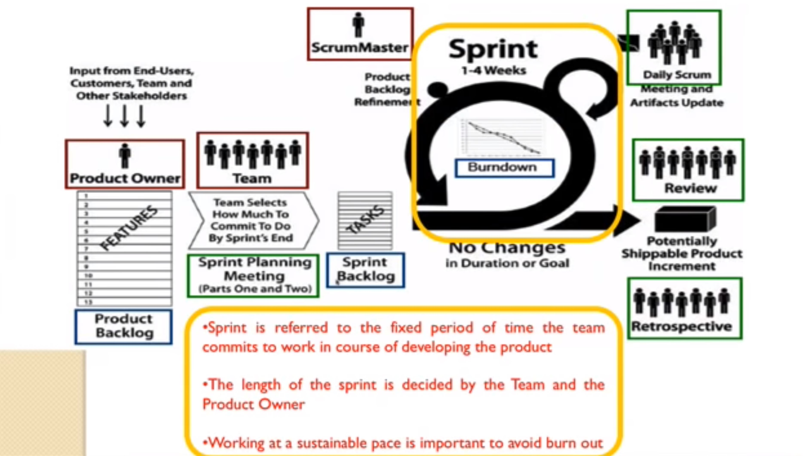

***

   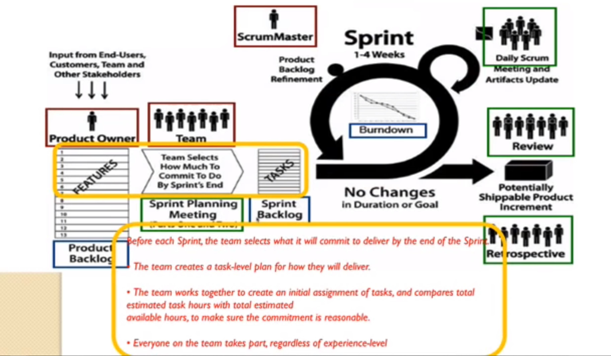

***

   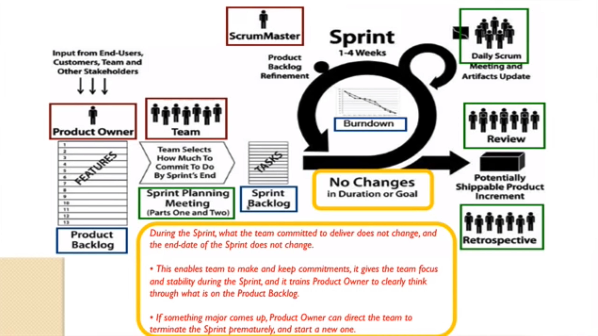

***

   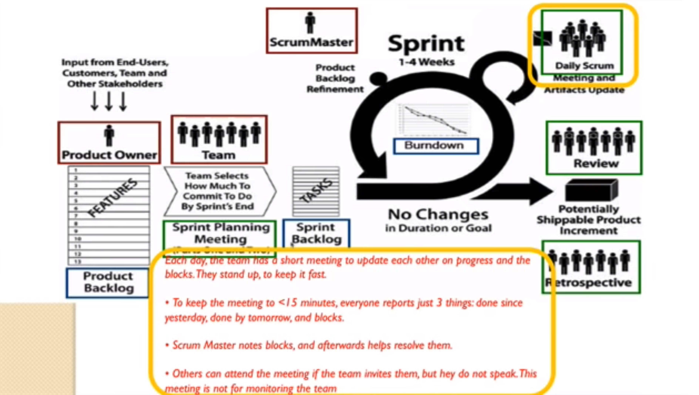

***

   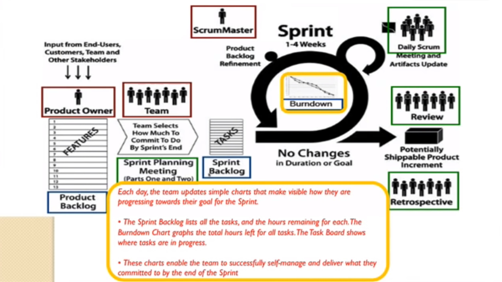

***

   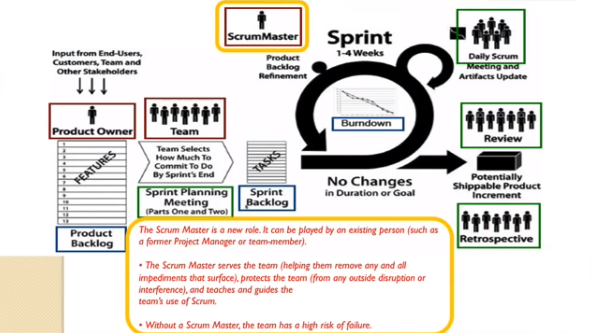

***

   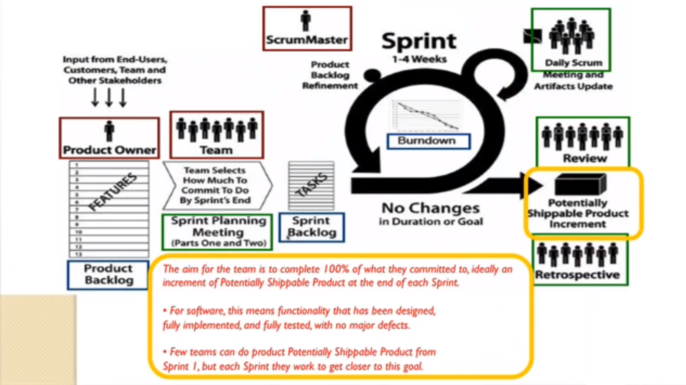

***

   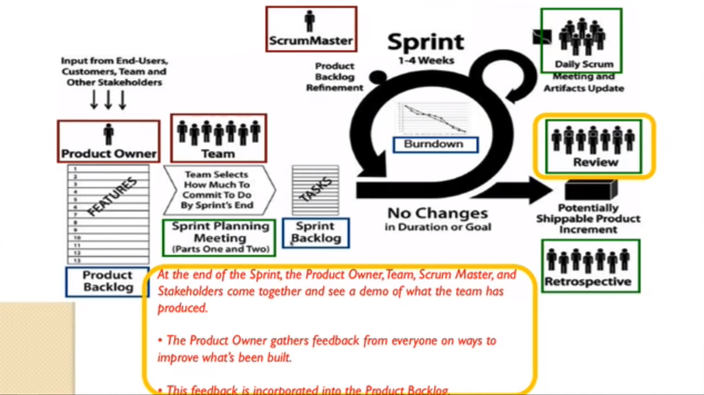

***

   

***

   

***

   

***