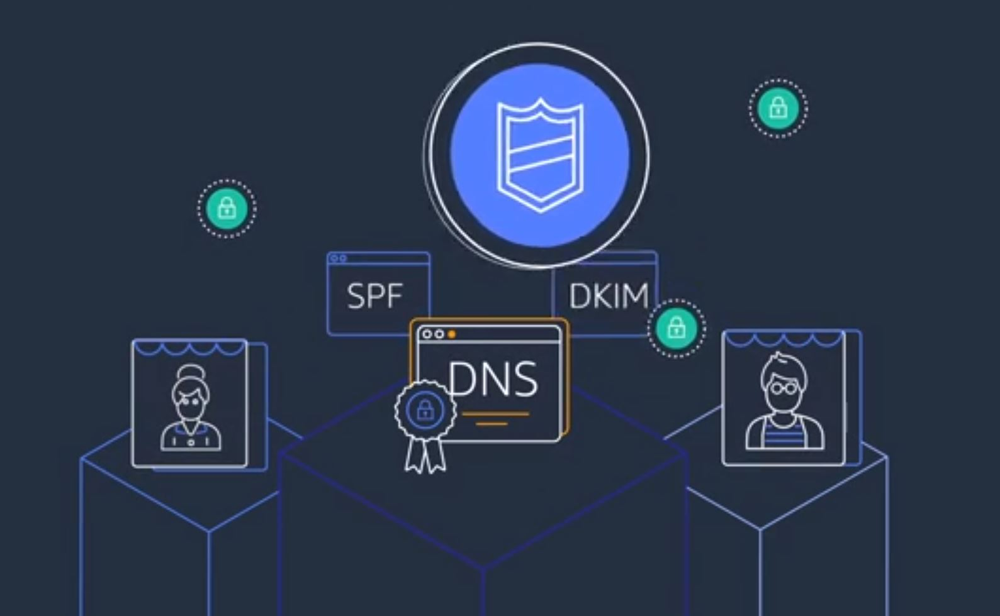
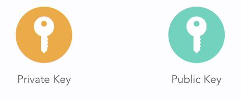
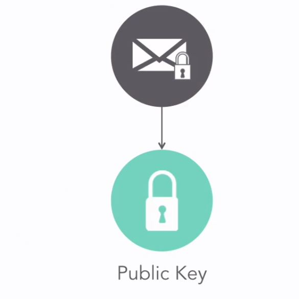
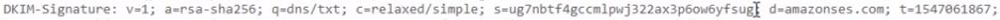

***


<div align="center">
    <h1 style="text-align:center;">Amazon SES</h1>
    
</div>


***
<div align="center">
    <h1 style="text-align:center;">SES Records</h1>
    
</div>

***
### __DKIM records__

<div align="center">
    
</div>

  * DKIM stands for DomainKeys Identified Mail and it is a spam prevention technique where your outgoing email server signs your emails so that the receiving email servers can verify that you were really the sender.
  * The DKIM records will be created as CNAME type records. CNAME is short for Canonical Name, and it's a DNS record that can point to another domain name record inside or outside of your current domain.
  * DKIM works by using public and private key cryptography Which are generated on the server. The public key is stored as a TXT record which is a special type of DNS record that can store text and notes about domain without necessarily pointing to an IP address or another place in the internet.

### __Sender Policy Framework (SPF)__
  * SPF uses a TXT record on your domain. And it tells mail servers who is authorized to deliver mail for this domain. amazon sets SPF behind the seems.

### __TXT Record__

   * The domain verification record is a TXT record that is required by AWS so they can prove that you own this domain name. A TXT record in your DNS zone file is a special type of record that includes additional information about domain that doesn't necessarily link to another domain or IP address.


<div align="center">
  <h1 style="text-align:center;">Email encrypted arrived</h1>
  
</div>

<div align="center">
  <h1 style="text-align:center;">check for DKIM-signature</h1>
  
</div>

***
### __Testing DKIM with DNS Records__
```
nslookup -tpye=TXT 5hsmshtyezjnopraccwmlrxdwg5z2don._domainkey.cloud.inecsoft.co.uk

nslookup -type=TXT _amazonses.cloud.inecsoft.co.uk
```

***

### __Verify your email address with SES__
  * Email address
  * Set email address, confirm and Test the email
***
### __Send Email through amazon SES with SMTP__
#### __SMTP Connections__
  * SMTP server name
  * SMTP port number
  * Encryption
  * Username and password

  In SMTP settings set create my smtp credentials.
   * An IAM user for SMTP authentication with Amazon SES
   * Get User credentials

***
### __WP Mail SMTP__
  __Settings__

  * From Email: info@inecsoft.co.uk
    - Force from email
  * From Name: Inecsoft
  * Mailer: Other SMTP
  * SMTP Host: email-smtp.eu-west-1.amazonaws.com
  * port: 587
  * Encryption: TLS
  * Authentication: On
  * SMTP Username:  
  * SMTP Password: 
  

***
### __SES for Cloud Watch__

***