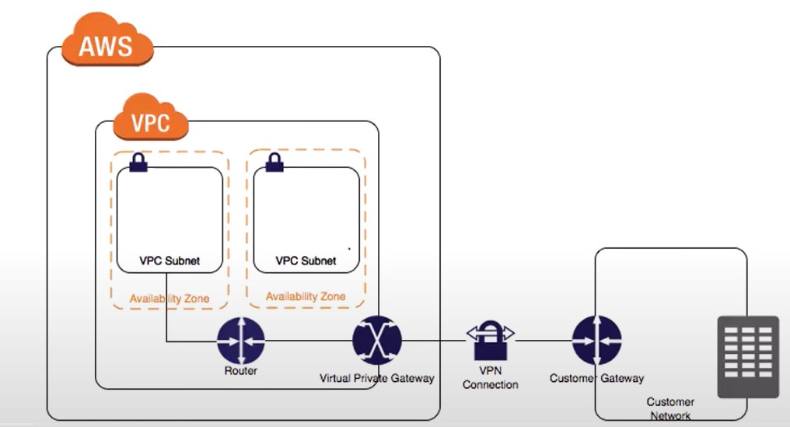
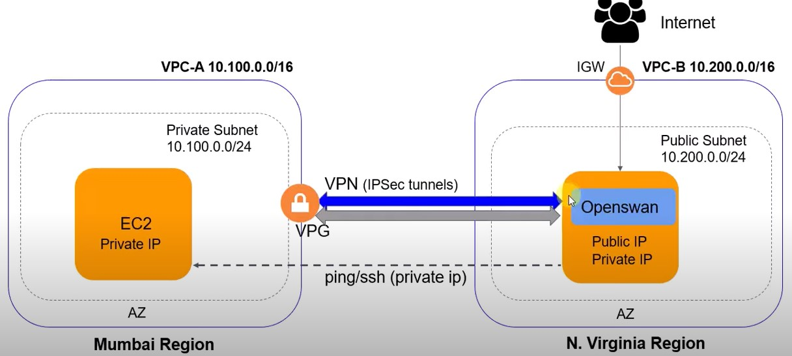

# **Site to site VPN**

<div align="center">

</div>

<div align="center">

</div>

### STEP 1 - Launch EC2 in ON-PREMISES VPC (Production Account)

### **Launch EC2 instance:**

- Disable source/destination checks
- Public subnet
- Security group: 22, ICMP=ALL
- Make a note of the public IP

### **STEP 2 - AWS VPC Configuration (Management Account)**

- Launch EC2 instance:

- Public or private subnet

- 22, ICMP=ALL

### **Create a customer gateway:**

- Name: AWS-VPC-CGW

- Routing: static

- IP: public IP of on-premises EC2

### **Create VGW**

- Name: AWS-VPC-VGW

- Attach to VPC

### **Create a VPN connection:**

- Name: ON-PREM-AWS-VPN

- Target type: Virtual Private Gateway

- Select the CGW and VGW

- Routing: static - enter prefix: e.g. 172.31.0.0/16, 10.0.0.0/16

### **Download VPN configuration as OpenSwan type**

### **STEP 3 - Enable route propagation for AWS VPC route table selecting the VGW (Management Account)**

### **STEP 4 - Configure OpenSwan on ON-PREMISES VPC EC2 Instance (Production Account)**

### **Run commands:**

sudo su
yum install openswan -y
nano /etc/sysctl.conf

### **Add:**

net.ipv4.ip_forward = 1
net.ipv4.conf.all.accept_redirects = 0
net.ipv4.conf.all.send_redirects = 0

sysctl -p

nano /etc/ipsec.d/aws.conf

### **Paste the tunnel configuration for TUNNEL 1. This can be obtained from the file we downloaded last task of step 2. Example:**

```
conn Tunnel1
  authby=secret
  auto=start
  left=%defaultroute
  leftid=<Public IP of OpenSwan/CGW>
  right=<Public IP of VGW - Tunnel 1>
  type=tunnel
  ikelifetime=8h
  keylife=1h
  phase2alg=aes128-sha1;modp1024
  ike=aes128-sha1;modp1024
  keyingtries=%forever
  keyexchange=ike
  leftsubnet=172.31.0.0/16
  rightsubnet=10.0.0.0/16
  dpddelay=10
  dpdtimeout=30
  dpdaction=restart_by_peer
```

### **IMPORTANT: REMOVE auth=esp from the code above if present**

```
vim /etc/ipsec.d/aws.secrets
```

### **Add single line: 54.169.159.173 54.66.224.114: PSK "Vkm1hzbkdxLHb7wO2TJJnRLTdWH_n6u3"**

### ** The above can be found in the downloaded config file - MUST be updated with correct values \***

### **Run commands:**

```
systemctl start ipsec
systemctl status ipsec
```

### **Connection should now be up**

### **Test by pinging in both directions and use additional host in on-premises DC to ping EC2 instance in AWS VPC (update route table)**

### **ssh to the instance_client_public_ip**

```
ssh ec2-user@54.155.93.109
```

```
sudo ipsec auto --status
sudo ipsec auto --verbose --up Tunnel1
sudo journalctl -u ipsec.service --no-pager --since '1 hour ago'
ip route show table main
```

```
sudo vim  /etc/ipsec.conf
tail /var/log/pluto.log -f

```

### **Sample log success tunnel connection**

```
Sep 28 15:09:40.188069: loading secrets from "/etc/ipsec.secrets"
Sep 28 15:09:40.188112: loading secrets from "/etc/ipsec.d/aws.secrets"
Sep 28 15:09:40.188240: "Tunnel1": We cannot identify ourselves with either end of this connection. 34.252.31.172 or <invalid> are not usable
Sep 28 15:09:40.188332: "Tunnel2" #1: initiating Main Mode
Sep 28 15:09:40.190321: "Tunnel2" #1: STATE_MAIN_I2: sent MI2, expecting MR2
Sep 28 15:09:40.193329: "Tunnel2" #1: STATE_MAIN_I3: sent MI3, expecting MR3
Sep 28 15:09:40.193916: "Tunnel2" #1: Peer ID is ID_IPV4_ADDR: '52.31.63.4'
Sep 28 15:09:40.194076: "Tunnel2" #1: STATE_MAIN_I4: ISAKMP SA established {auth=PRESHARED_KEY cipher=aes_128 integ=sha group=MODP1024}
Sep 28 15:09:40.194099: "Tunnel2" #2: initiating Quick Mode PSK+ENCRYPT+TUNNEL+PFS+UP+IKEV1_ALLOW+IKEV2_ALLOW+SAREF_TRACK+IKE_FRAG_ALLOW+ESN_NO {using isakmp#1 msgid:6391a7c2 proposal=AES_CBC_128-HMAC_SHA1_96-MODP1024 pfsgroup=MODP1024}
Sep 28 15:09:40.243879: "Tunnel2" #2: STATE_QUICK_I2: sent QI2, IPsec SA established tunnel mode {ESP/NAT=>0xc4315d59 <0xa5f5dc95 xfrm=AES_CBC_128-HMAC_SHA1_96 NATOA=none NATD=52.31.63.4:4500 DPD=active}
```

ipsec setup start|stop|restart maps to the host init system. Supported init systems are sysv, systemd, upstart and openrc.

       ipsec barf dumps the internal system status to stdout for debugging

       ipsec auto is used to manually add, remove, up or down connections. For more information see 'man ipsec_auto

       ipsec whack is used to communicate direct commands to the pluto daemon using the whack interface. For more information see 'man ipsec_pluto'

       ipsec initnss initialises the NSS database that contains all the X.509 certificate information and private RSA keys

       ipsec checknss [--settrusts] is used to check the NSS database and initialize it when it is not present and optionally set trust bits for CA certificates.

       ipsec import is used to import PKCS#12 X.509 files into the NSS database

       ipsec checknflog is used to initialise iptables rules for the nflog devices when specified via the nflog= or nflog-all= configuration options.

       ipsec stopnflog is used to delete iptables rules for the nflog devices.

---
