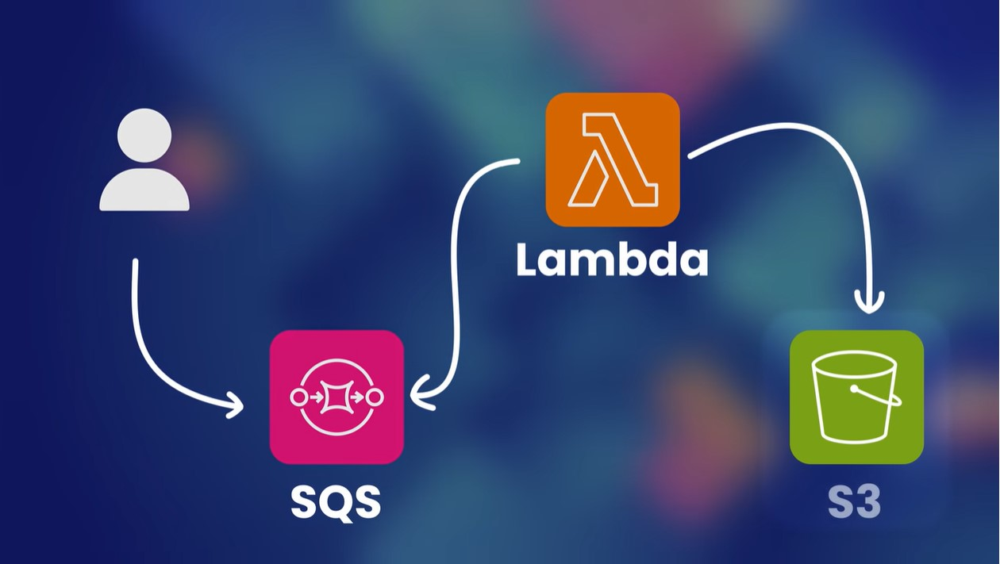

 <div align="center">
    
</div>

# iac-intro

This project provides the demo code for the introduction to iac

# Requirements

- Go 1.20
- Terraform 1.4.6

# Project structure

The source code for this project lives in `src` which contains the go code
for the lambda. All infrastructure work should be in the `infrastructure`
directory

### **How to build go app**

```
cd src
sudo make build
sudo chown -R iarteaga. ../bin/
```
