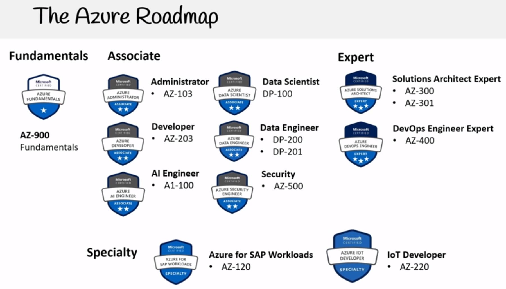

![Terraform][terraform-version]

# Overview

Creates Azure virtual machines with DevOps tools from a Packer image (packer/devops-vm.json).

```
export ARM_CLIENT_ID="your_client_id"
export ARM_CLIENT_SECRET="your_client_secret"
export ARM_TENANT_ID="your_tenant_id"
export ARM_SUBSCRIPTION_ID="your_subscription_id"

time packer build packer/devops-vm-windows.json
```

# Getting started

Running Terraform against Azure requires the Azure CLI. Visit this site to see how to [install](https://docs.microsoft.com/en-us/cli/azure/install-azure-cli) this on your system.

If you are running a console in a remote terminal then you will need to login to Azure using `az login`, and input the authorization code into the following URL: https://aka.ms/devicelogin.

Before running Terraform, you need to export the ARM_ACCESS_KEY environment variable on your system.

Once installed initialse the repository with the version of Terraform at the top of this readme. (`terraform init`).

# Adding/removing DevOps team members

To add a new VM, add a corresponding username to the `devops_users` variable. Then add your **public** key to the authorized_keys directory.

# Importing resource group

If you use the setup_tf_backend.sh script, you'll have to manually import the created `TF-Azure-DevOps` resource group into the Terraform state:

```terraform import azurerm_resource_group.main \
  /subscriptions/dd950ac0-ada1-45c3-8a4a-83c22f16c43e/resourceGroups/TF-Azure-DevOps
```

You then need to update the `storage_account_name` field in providers.tf with the output of the above command :

```
  "created": true
}
...
storage_account_name: tstate30033
...
```

# Initializing Packer

To initialise Packer with your TfGM Azure credentials, run this from the command line `az ad sp create-for-rbac --query "{ client_id: appId, client_secret: password, tenant_id: tenant }"`

You can edit the VM initialisation script at packer/devops-vm.json. Once completed you can update the packer image by running `packer build -force packer/devops-vm.json` from the project root.

[terraform-version]: https://img.shields.io/badge/Terraform-v0.14.2-blue?style=plastic&logo=appveyor.

# Setting up your development environment

Once you've got the public IP address of your virtual machine, follow the steps in [this article](https://code.visualstudio.com/docs/remote/ssh) to connect Visual Studio Code via SSH to host.

You will need to configure the remote host with your personal credentials:

- AWS credentials - ~/.aws/config ~/.aws/credentials
- SSH - ~/.ssh/id_rsa ~/.ssh/id_rsa.pub
- Git - ~/.gitconfig
- Kubernetes - ~/.kube/config

You will need to add the **public** SSH key you've generated above to your profile in GitHub, so you're able to clone repositories from the remote host.

---



---

- #### **Install Azure CLI with yum**
  **1. Import the Microsoft repository key.**

```bash
sudo rpm --import https://packages.microsoft.com/keys/microsoft.asc
```

**2. Create local azure-cli repository information.**

```bash
sudo sh -c 'echo -e "[azure-cli]
name=Azure CLI
baseurl=https://packages.microsoft.com/yumrepos/azure-cli
enabled=1
gpgcheck=1
gpgkey=https://packages.microsoft.com/keys/microsoft.asc" > /etc/yum.repos.d/azure-cli.repo'
```

**3. Install with the yum install command.**

```bash
sudo yum install azure-cli -y
```

- #### **Login to get the credentials.**

```bash
az login --use-device-code
az account set --subscription dd950ac0-ada1-45c3-8a4a-83c22f16c43e
az account show
```

_*Note:*_ After login set your project it works fine.

- ### **Set up Terraform access to Azure**

**1. Get a list of subscription ID and tenant ID values:**

```
az account list
az account list --query "[].{name:name, subscriptionId:id, tenantId:tenantId}"
SUBSCRIPTION_ID=`az account list | grep id | awk -F '"' '{print $4}'`
```

**2. To use a selected subscription, set the subscription for this session with**

```
az account set --subscription="${SUBSCRIPTION_ID}"
```

**3. Create a service principal for use with Terraform**

```
az ad sp create-for-rbac --role="Contributor" --scopes="/subscriptions/${SUBSCRIPTION_ID}"
```

---

## **REF:**

https://www.terraform.io/language/settings/backends/azurerm
https://docs.microsoft.com/en-us/azure/developer/terraform/store-state-in-azure-storage?tabs=azure-cli

---

[ Terraform Azure backend ](https://www.terraform.io/language/settings/backends/azurerm)

[Store Terraform state in Azure Storage](https://docs.microsoft.com/en-us/azure/developer/terraform/store-state-in-azure-storage?tabs=azure-cli)

[AZURE DEVOPS DEMO GENERATOR](https://azuredevopsdemogenerator.azurewebsites.net/)

---

#### **Install tfenv**

```
git clone https://github.com/tfutils/tfenv.git ~/.tfenv
echo 'export PATH="$HOME/.tfenv/bin:$PATH"' >> ~/.bashrc
source ~/.bashrc
which tfenv
```

---

### **Configuration file to manage git repos using custom ssh key pair**

ssh-keygen -t rsa -t 2048 -f github
vim ~/.ssh/config

```
Host your.hostname.com
  HostName github.com
  User username
  IdentityFile C:\Users\Ivan\.ssh\github
```

```
ssh-agent bash
ssh-add ~/.ssh/github
```

---

### **Precommit tool**

```
curl https://pre-commit.com/install-local.py | python -
echo 'export PATH=$PATH:~/bin' >> ~/.bashrc
source ~/.bashrc
pre-commit --version
```

```
vim ~/.pre-commit-config.yaml
repos:
- repo: git://github.com/antonbabenko/pre-commit-terraform
  rev: v1.45.0
  hooks:
    - id: terraform_fmt
    - id: terraform_validate
    - id: terraform_tflint
    #- id: terraform_tfsec
    - id: terraform_docs
```

### **Install the git hook scripts**

```
pre-commit install
```

### **Run hooks**

```
pre-commit run -a
```

---

### **To create a connection to run your pipeline**

[How to create a connection](https://docs.microsoft.com/en-us/azure/devops/pipelines/release/azure-rm-endpoint?view=azure-devops)

---
