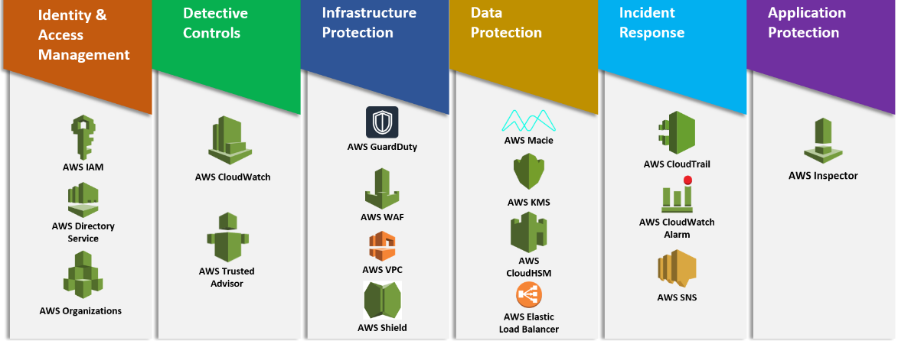
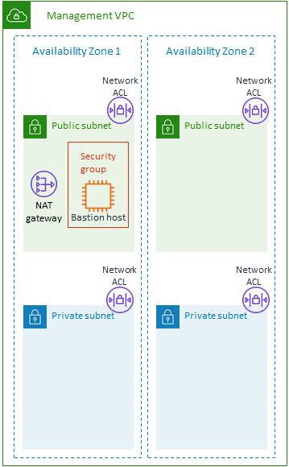
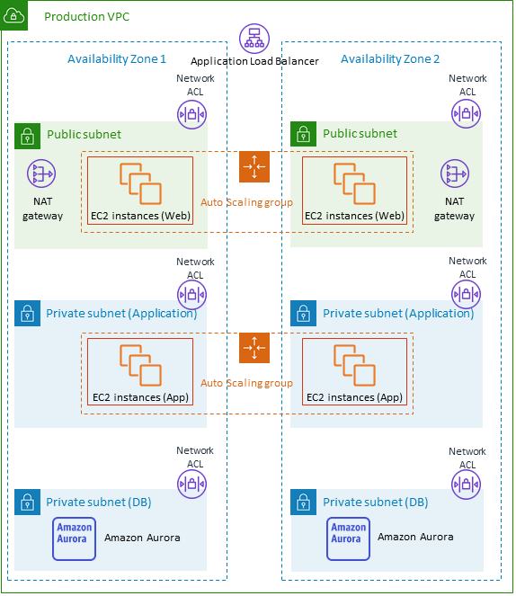
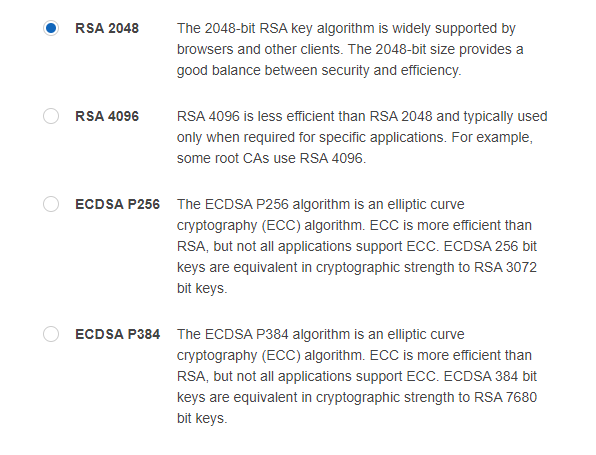

# **Overview of  “AWS security Pillar” or well architecture Framework.**

<div align="center">
    
</div>

## **2 TIER web application**

1. For internet-facing applications, it’s very important to ensure that you’re protecting the front door of your application. AWS WAF has been used to protect against malicious attacks. At the moment WAF is implemented only at the OS lever to save money. The Apache modules enabled (mod_ratelimi, mod_security, mod_security_crs)  as  WAF.  Also, AWS Shield to provide the layer of defence against Distributed Denial of Service (DDoS) attacks by default. Advanced shield costs $3000 /monthly for extra protection.

   ### __INFRASTRUCTURE PROTECTION TOPIC:__ 
   The new infrastructure uses AWS VPC, to contain all the services and infrastructure inside it. Amazon GuardDuty is priced along two dimensions. The dimensions are based on the quantity of AWS CloudTrail Events analyzed (per 1,000,000 events) and the volume of Amazon VPC Flow Log and DNS Log data analyzed (per GB). There is no additional charge to enable these log sources for GuardDuty analysis.

* #### __CloudTrail Event analysis__ -- GuardDuty continuously analyzes CloudTrail Events, monitoring all access and behaviour of your AWS accounts and infrastructure. CloudTrail analysis is charged per 1,000,000 events per month and pro-rated.

* #### __VPC Flow Log and DNS Log analysis__ -- GuardDuty continuously analyzes VPC Flow Logs and DNS requests and responses to identify malicious, unauthorized, or unexpected behaviour in your AWS accounts and workloads. Flow log and DNS log analysis are charged per Gigabyte (GB) per month. Flow log and DNS log analysis are offered with tiered volume discounts.

<div align="center">
    
</div>

2. To segregate network boundaries of control, AWS Network Access Control Lists (NACL) are used in between subnets to ensure only the traffic that is permitted will flow.
‍INFRASTRUCTURE PROTECTION TOPIC: inside the VPC I delimited the public subnet in the public ranges 10.0.1.0/24, 10.0.2.0/24, 10.0.3.0/24. Access to the internet is routed (using route tables and route associations)through the internet gateway on 10.0.1.0/24  and private ranges, network.10.0.101.0/24,10.0.102.0/24,10.0.103.0/24. Internet access only routed(using route tables and route table associations) throughout NAT gateway($ 35.14)(mapped to the EIP ” elastic IP ”). Security groups act as a network firewall for all traffic to the instances and services based on port. The security group for alb allows traffic from 0.0.0.0/0 port 80 and 443. the ALB forwards 80 to 443 with SSL and terminated  SSL connections forwarding his to the fleet of front-end instances on port 80 (**Drop Invalid Header Fields**is Disabled. It needs to be enabled manually. The terraform code does not support the option!!!).

<div align="center">
    
</div>

   The front-end is generated by an auto-scaler that expands depending on demand/load from 2 to 5 (t3.micro minimum cost). The front-end security group only allows port 80 from ALB, port 22 from bastion host, and traffic to RDS on port 5432. The aurora Postgres RDS master and replicas t3.medium (minimum cost USD 0.088/H)and sitting on separated own private subnet. The replicas autoscale on demand from 1 to 4. The security group only allows 5432 from bastion and frontend fleet and port 22 from the bastion. The bastion only allows 0.0.0.0/0 on port 22 (no root user, no password) user default ec2-user and ssh key pair.  On the OS level, we have firewall security (firewall-cmd)as well plus, SELinux(security policies).

3. AWS Key Management Service (KMS) will provide the ability to encrypt data at rest for services such as AWS Elastic Block Storage (EBS)(EFS) and Amazon Relational Database Service (RDS); where snapshots and backups are integrated within RDS. All the infrastructure is encrypted using KMS except for the bastion. The encryption algorithm for symmetric CMKs is also known as SYMMETRIC_DEFAULT. This represents a symmetric algorithm based on Advanced Encryption Standard (AES) in Galois Counter Mode (GCM) with 256-bit keys, an industry-standard for secure encryption but, this security level is sufficient to make brute force attacks on AWS KMS ciphertexts infeasible. (DEVOPS-47).

4. Passwords often find themselves in configuration and this can lead to data leaking into the hands of people who shouldn’t have it. To make the management of this seamless, AWS Secrets Manager has been used which has native support for AWS RDS to easily manage the rotation and delivery of credentials to the privileged resources that require them. N/A unless required.

   __How to do so:__

   https://s3.amazonaws.com/rds-downloads/rds-ca-2019-root.pem

   https://s3.amazonaws.com/rds-downloads/rds-combined-ca-bundle.pem

```
mysql -h endpoint -u  ivanpedro  -P 5432 -p
mysql> CREATE USER ivanpedro IDENTIFIED WITH AWSAuthentication Plugin as 'RDS';

RDSHOST=""
#the token expires every 15 minutes
TOKEN=("$aws rds generate-db-auth-token --hostname $RDSHOST --port 3306 --region eu-west1  --username ivanpedro")

mysql --host=$RDSHOST --port=5432 --ssl-ca=/sample_dir/rds-combined-ca-bundle.pem --enable-cleartext-plugin --user=ivanpedro --password=$TOKEN
```

5. Network traffic can be hard to keep a track of and filter through if all traffic that’s traversing your application is in fact authorized and non-malicious. To intelligently detect any threats in the network, AWS GuardDuty has been enabled to continuously inspect the VPC Flow Logs and alert if any malicious behaviour is detected. Only VPC flow log is enabled in case we need it and we need to create our own check intelligence.
‍
6. Last but not least to ensure that all API calls within an account are logged it’s important to enable AWS CloudTrail to provide governance over the actions that are performed. by default, all access/actions committed to the infrastructure are logged on cloud trail this does not mean ssh to bastion or https to the app.

<div align="center">
    <b style="text-align:center">SSL Certificate:</b>
</div>


<div align="center">
    
</div>

[ Manual Doc](doc/aws-waf-owasp.pdf)

[ Presentation Slide Doc ](doc/well-architectureframework.pptx)