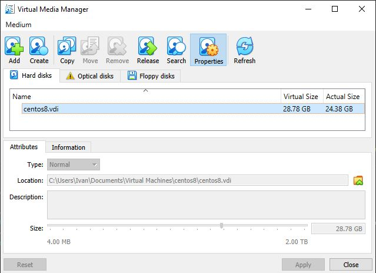
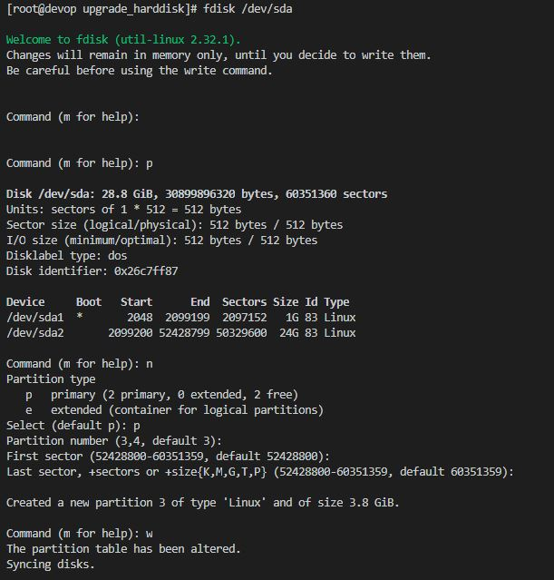
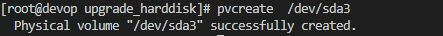
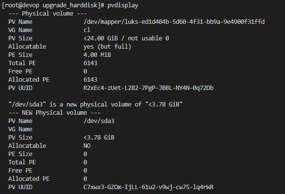
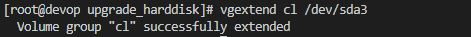
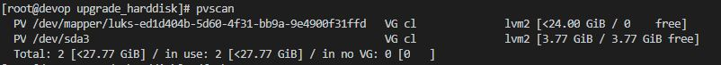
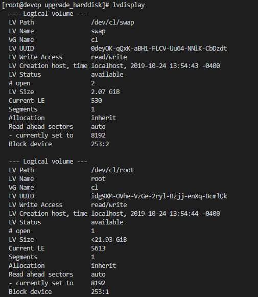
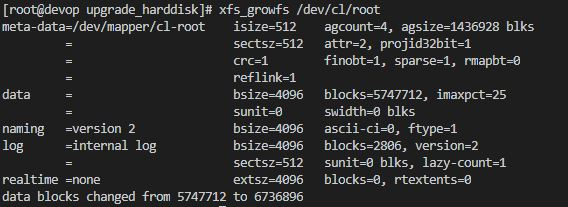
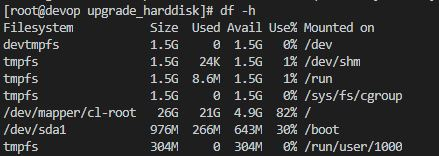

***

<div align="center">
  
</div>

***

### __The instance must be one of the following:__

1. Shutdown the VM
2. Right click the VM and select Edit Settings
3. Select the hard disk you would like to extend
4. On the right side, make the provisioned size as large as you need it
5. Click OK
6. Power on the VM
7. Connect to the command line of the Linux VM via the console or putty session
8. Log in as root
9. The fdisk command provides disk partitioning functions and using it with the -l switch lists information about your disk partitions.  At the command prompt type fdisk -l
10. The response should say something like Disk 

```
fdisk /dev/sda1
```

<div align="left">
  
</div>

11. __To avoid a reboot:__
```
partprobe /dev/sda3

or

partx -a /dev/sda3
```

12. __Creates a physical volume:__
```
pvcreate  /dev/sda3
```

<div align="left">
  
</div>

13. __Provides lots of information on the Physical Volumen:__
```
pvdisplay
```

<div align="left">
  
</div>

14. __Provides lots of information on the volume group:__
<div align="left">
  
</div>

15. __Add physical volumen to volumen Group:__
```
vgextend cl /dev/sda3
```
<div align="left">
  
</div>

16. __The original /dev/sda2 partition and the newly created physical volume /dev/sda3__

<div align="left">
  
</div>

17. __Get the path of the logical volume:__
```
lvdisplay 
```

<div align="left">
  
</div>

18. __The logical volume is then extended using the lvextend command:__
```
lvextend /dev/cl/root /dev/sda3
```

<div align="left">
  
</div>

19. __You can grow the file system XFS:__
```
xfs_growfs /dev/cl/root
```

<div align="left">
  
</div>

19. __You can grow the file systemif LVM:__
```
resize2fs /dev/cl/root
```

20. __The total available disk space has been increased:__
```
df -h
```
<div align="left">
  
</div>

***