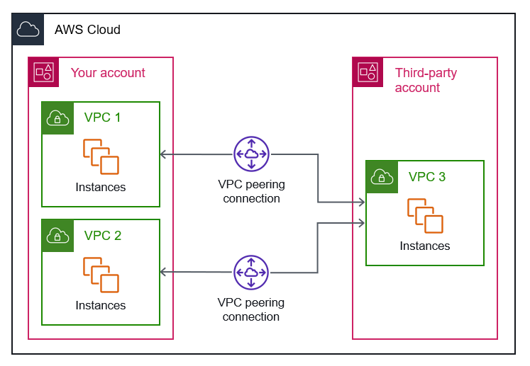

---

---

# **Troubleshoot a VPC peering connection**

### **If you're having trouble connecting to a resource in a VPC from a resource in a peer VPC, do the following:**

For each resource in each VPC, verify that the route table for its subnet contains a route that sends traffic destined for the peer VPC to the VPC peering connection. For more information, see Update route tables.

For EC2 instances, verify that the security groups for the EC2 instances allow traffic from the peer VPC. For more information, see Reference peer security groups.

For each resource in each VPC, verify that the network ACL for its subnet allows traffic from the peer VPC.

---
