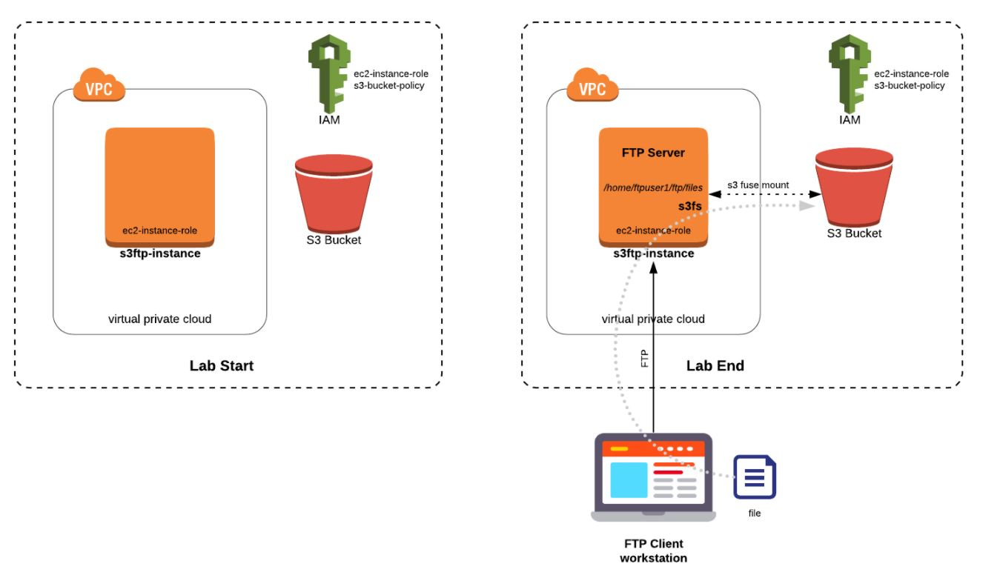

***

 <div align="center">
    
</div>

***
### __The instance must be one of the following:__

EC2 instance with a public IP address and a route table entry with the default route pointing to an Internet Gateway.
Private EC2 instance with a default route through a NAT gateway.
Private EC2 instance with connectivity to Amazon S3 using a Gateway VPC Endpoint.

### __Validate access to S3 buckets__

1.    Install the AWS CLI.

2.    Verify access to your S3 buckets by running the following command:

```
aws s3 ls

s3fs  default-vpc-s3-mount-ec2-s3-bucket-mount /var/default-vpc-s3-mount-ec2-s3-bucket-mount -o use_cache=/tmp -o allow_other -o iam_role="default-vpc-s3-mount-ec2-iam-ec2-role" -o url="https://s3-eu-west-1.amazonaws.com" -o endpoint=eu-west-1 -o dbglevel=info -f -o curldbg

df -h
```

*__Note:__* 

```
s3fs            256T     0  256T   0% /var/default-vpc-s3-mount-ec2-s3-bucket-mount
```
### __Test download S3 kms-encrypted objects__
```
aws s3api get-object --bucket example-bucket-name --key dir/example-object-name example-object-name
aws s3api put-object --bucket default-vpc-s3-mount-ec2-s3-bucket-mount --key data/

aws s3 ls  default-vpc-s3-mount-ec2-s3-bucket-mount
```
***