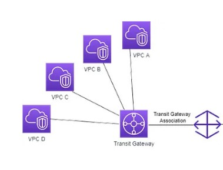

---

# **Transit Gateway**

 

    

The Transit gateway is used to connect multiple VPCs from on-premise to the same AWS region. In this diagram, the Region has multiple VPCs and it is connected to the transit gateway. The Direct Connect gateway is connected with the Transit gateway through transit gateway associations. The Direct Connect gateway is connected to the Direct Connect location using a transit virtual interface.

---

### **Default route table**

#### \* _after creting the transit gateway attachments_

#### \* _Check transit gateway Route tables_

    1- Associations
    2- Propagations
    3- Routes. That are created automatically when propagations are created.

_Note:_ Go to route tables of the vpcs and create route like:
10.0.0.0/8 pointing to the transit gateway.
this will allow the traffic between the vpcs through the TGW.

### **Custom route table**

testing:

echo "var.vpc"| terraform console

---
