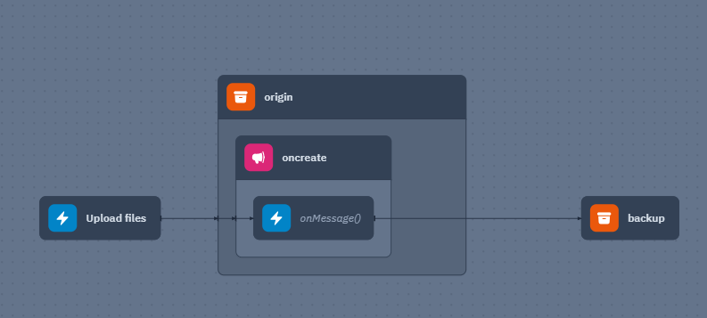

### **Start a wing project**

```
wing new empty --language wing
```

wing compile - build your project
wing it - simulate your app in the Wing Console
wing test - run all tests

Visit the docs for examples and tutorials: https://winglang.io/docs

```
wing compile -t tf-aws main.w
```

```
cd ./target/main.tfaws
export AWS_REGION=eu-west-1 # or any other region
export AWS_PROFILE=ivan-arteaga-dev
terraform init
```

### **Ref:** "gitignore.io"


