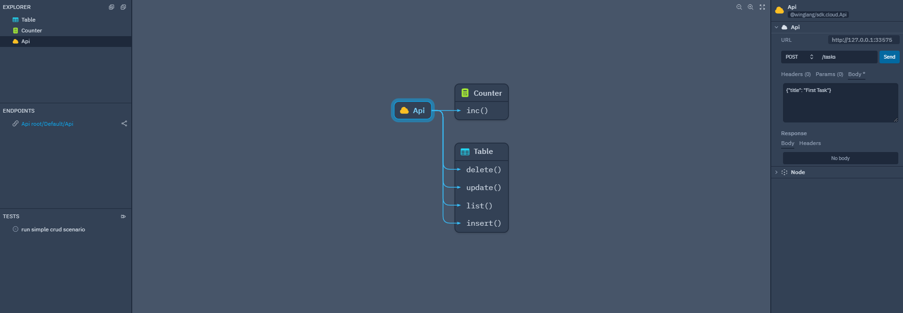
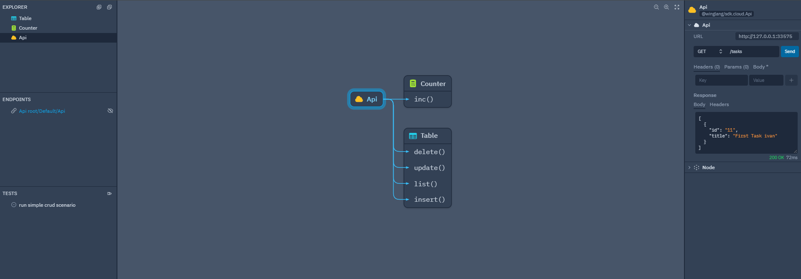
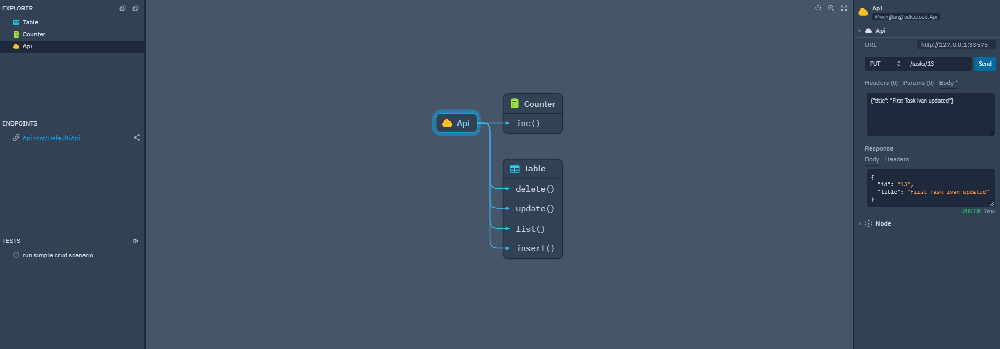
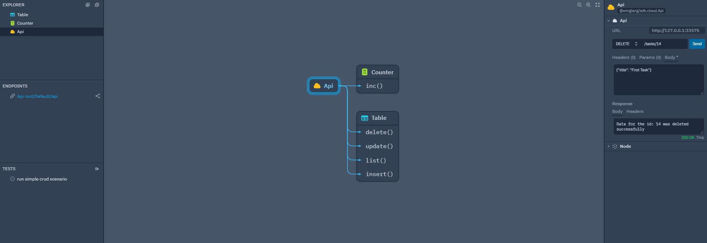

## **Testing project**

### **how to test post method**



### **how to retrieve the values with get method**



### **how to update the values with put method**



### **how to delete the values with put method**



### **Start a wing project**

```
wing new empty --language wing
```

wing compile - build your project
wing it - simulate your app in the Wing Console
wing test - run all tests
wing docs

Visit the docs for examples and tutorials: https://winglang.io/docs

```
wing compile -t tf-aws main.w
```

### **Compile backend with wing plugin**

```
wing compile -t tf-aws --plugins=plugin.static-backend.js main.w
```

### **debug it and expose a debug server.**

```
node --inspect $(which wing)
```

```
cd ./target/main.tfaws
export AWS_REGION=eu-west-1 # or any other region
export AWS_PROFILE=ivan-arteaga-dev
terraform init
```

### **Ref:** "gitignore.io"

### **Doc:** https://www.winglang.io/blog/2024/03/12/crud-rest-api
